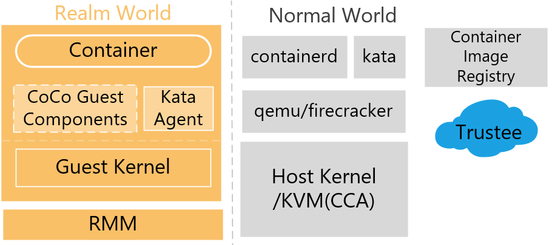

# 阶段一-基于MicroVM的机密容器快速启动技术

# 一. **概述**



项目阶段一交付的基于MicroVM的机密容器快速启动的ARM CCA机密容器原型系统架构如上图。

下文将对系统中的核心组件的功能、流程进行概述：

## 1. 核心组件

### **(0). ARM CCA模拟平台**

图中的领域世界与普通世界中组件均运行于ARM CCA模拟平台中。然而当前未有支持ARM CCA的开发板，因此本项目基于Linaro提供的CCA模拟平台测试。该CCA模拟平台基于QEMU实现，为QEMU中virt与sbsa（Server Base System Architecture）两个虚拟开发板实现了TEE支持。其中virt针对嵌入式平台，sbsa针对服务器平台，sbsa可支持更大内存。因此项目选用sbsa虚拟开发板测试，模拟平台的具体搭建方式可参考该[文档](https://linaro.atlassian.net/wiki/spaces/QEMU/pages/29051027459/Building+an+RME+stack+for+QEMU)。

### **(1). Firecracker**

Firecracker是由AWS开源的针对无服务器计算场景的轻量级VMM，只实现运行轻量级虚拟机所需的最小设备仿真与虚拟机配置，从而降低复杂VMM功能带来的系统开销。

项目本阶段主要实现通过Firecracker替代现有QEMU启动机密虚拟机，实现轻量级机密虚拟机。其中挑战主要在于Firecracker未支持任何平台的机密虚拟化技术，需要针对机密虚拟机管理接口对Firecracker进行重新设计。

### **(2). Kata containers相关组件**


Kata Container项目利用虚拟化技术构建安全的容器运行时。相比于传统容器运行环境，Kata Container中每个容器运行于单独的虚拟机中，加强了容器与宿主机之间的隔离性。Kata Container将OCI运行时功能划分为对接OCI接口与构建容器环境，在宿主机中以Kata Runtime对接OCI接口并启动虚拟机，虚拟机中的Kata Agent继而完成容器环境的构建。Kata Runtime与Kata Agent间通过grpc协议交互，保持尽可能小的接口，可防止虚拟机中的恶意容器负载逃逸至宿主机中，保证了系统的安全性。

项目本阶段对Kata Containers修改主要在宿主机中Kata Runtime一侧，打通从Kata Containers的配置文件中的机密虚拟化支持选项至Firecracker配置文件中的CVM选项间的配置通路，使Kata Runtime可以调用Firecracker启动CVM，并在CVM中启动CoCo。

### **(3). Guest Components相关组件**


Guest Components是运行在机密虚拟机中的二进制程序，来自COCO社区的开源项目https://github.com/confidential-containers/guest-components，如上图所示，Guest Components包含组件 confidential-data-hub(CDH)、attestation-agent(AA)、api-server-rest(ASR)和 image-rs。其中 CDH 负责与Trustee通信从而完成机密数据的获取、解密和存储，并且作为一个ttRPC服务端为guest内部组件提供相关服务。AA 负责获取和签名机密虚拟机的度量值以及生成远程证明报告，与Trustee通信完成远程证明，同时也作为一个ttRPC服务端提供相关服务。ASR是一个利用ttRPC技术搭建的RESTful API 网关，通过ttRPC调用CDH和AA从而给guest机密虚拟机内部应用如Kata Agent提供调用 Guest Components 的接口。image-rs 负责拉取和解密镜像，直接编译到CDH的二进制程序中。

Guest Components在机密容器的启动过程中主要负责以下功能：

(1).获取和签名机密虚拟机的度量值

Guest Components通过AA采集机密虚拟机（CVM）的硬件信任链度量值，包括cca平台的度量值、机密虚拟机的运行时度量值等。获取到度量值之后，AA会使用硬件密钥对度量值进行签名，并且通过包装生成特定格式的度量报告，度量报告随后被用于远程证明。

(2).与trustee通信完成远程证明

Guest Components通过CDH建立与指定的外部 Trustee服务通信完成远程证明。首先，CDH 作为密钥代理客户端（KBC）向Trustee发送请求以发起身份认证；随后 Trustee 返回包含认证挑战（Attestation Challenge）和会话标识符（HTTP Cookie）的响应，要求 CDH 提供其所在硬件可信执行环境（CCA）的可信证明；CDH 通过AA获取度量报告并附带收到的Attestation Challenge提交至Trustee，Attestation Challenge是Trustee生成的随机数，可以保证度量报告为最新生成的有效数据；Trustee 验证通过后与CDH建立临时会话，此后 CDH 可在会话有效期内通过 HTTP Cookie 的维持直接向 KBS 请求加密数据或密钥，无需重复证明流程。

(3).从Trustee获取机密数据

Guest Components在机密虚拟机通过远程证明之后，可以通过CDH向Trustee请求获取机密数据，例如解密镜像的密钥、机密文件、证书等等。

(4).拉取及解密容器镜像

Guest Components可以通过CDH调用组件image-rs拉取和解密容器镜像。image-rs是一个轻量级的OCI（Open Container Initiative）容器镜像管理工具，支持从镜像仓库拉取OCI/docker v2格式的容器镜像、支持对OCI镜像的签名验证、支持OCI镜像的解密等等。因此在通过CDH从Trustee获取加密镜像的密钥之后，image-rs可以完成拉取加密镜像并且进行解密的工作。

### **(4). Trustee相关组件**


Trustee是机密计算架构中的可信第三方服务，代表机密计算工作负载（如机密容器）的所有者，可以由云厂商或者用户部署，Trustee中的服务和配置必须保证对用户可信和完整。如上图所示，trustee由 Key Broker Service(KBS)，Attestation Service(AS)，Reference Value Provider Service(RVPS)组成，主要负责提供远程证明和密钥管理服务。其中 KBS 负责与guest通信，以及密钥的分发与管理，AS 用于验证机密容器的可信性，RVPS 提供可信的参考值及测量策略用于验证。Trustee在机密容器的启动过程中主要负责以下功能：

(1).远程证明

Trustee提供RVPS服务让用户可以预设期望的度量报告参考值，随后在远程证明的过程中，KBS与Guest Components建立通信，获取到Guest Components远程证明请求中包含的guest度量报告，KBS调用AS利用RVPS中用户期望的度量报告参考值验证guest度量报告的完整性，如果guest度量报告通过验证，KBS为guest提供有效的Cookie，guest可以通过Cookie在有效时间内向Trustee请求数据。

(2).密钥管理

Trustee通过KBS给通过远程证明的机密容器环境安全分发密钥、证书和其他数据。用户可以将准备好的解密镜像的密钥、机密文件和证书等存放在Trustee的KBS仓库中，同时在加密镜像时加入KBS存放的密钥路径信息，这样机密容器启动时，机密虚拟机会根据容器镜像注解中的信息自动发起远程证明并且从对应的KBS路径请求获取密钥，然后完成镜像的解密并成功启动加密镜像。

### **(5). Container Image Registry镜像仓库**

Container Image Registry 负责存储和管理加密的容器镜像，确保镜像在传输和存储过程中的机密性与完整性。系统使用的Container Image Registry 需支持标准的 OCI镜像格式，可以使用docker提供的dockerhub作为镜像仓库使用，或者建立私人镜像仓库。

## 2.启动流程概述

### (1).containerd调用Kata Runtime通过Firecracker启动机密虚拟机

Kata Runtime仅实现了对接containerd的OCI Runtime接口，通常不直接调用Kata Runtime执行程序，而是通过nerdctl命令行工具调用containerd指定使用kata runtime作为容器运行时启动容器。

示例命令如下：

```bash
sudo nerdctl run --snapshotter=guest-pull --annotation "io.kubernetes.cri.image-name=docker.1ms.run/library/busybox:latest" --runtime=io.containerd.run.kata.v2 -it --rm --name=hello1 docker.io/library/busybox:latest sh
```

当运行命令时大致流程如下：

1. nerdctl向containerd监听的unix socket发送容器创建请求
2. containerd根据配置文件通过OCI Runtime接口调用Kata Runtime创建容器
3. Kata Runtime根据其配置文件，选用Firecracker创建CVM启动容器
4. Firecracker与KVM交互，创建CVM
5. CVM启动后调用Kata Agent开始构建容器运行环境

### (2).Kata Agent拉取容器镜像并启动机密容器


Kata Agent在初始化的过程中，会按用户配置启动包括CDH、AA、ASR在内的Guest Components组件，然后调用相关组件拉取和解密加密容器镜像。下面描述拉取和解密加密容器镜像的过程，如上图所示。

(1).根据Kata Runtime提供的容器镜像信息，Kata Agent通过CDH调用image-rs拉取和解密加密镜像，并且创建可挂载目录bundle供启动容器使用。

(2).Kata Agent调用CDH接口试图获取密钥解密镜像，CDH调用AA向Trustee发起远程证明。AA负责生成guest的度量报告并且发送远程证明的请求给KBS。

(3).KBS收到远程证明的请求后调用AS验证度量报告，AS通过用户提供的rvstore和tastore值对度量报告进行验证，之后又通过RVPS提供的度量报告参考值进一步验证和决策。

(4).度量通过之后，KBS向AA返回guest的身份令牌token，guest可以携带token向Trustee请求获取机密数据。

(5).CDH已经通过AA完成远程证明，此时CDH携带AA获取的token向Trustee发送请求，请求获取解密镜像所需的密钥。

(6).KBS收到CDH发送的获取密钥的请求，首先确认token是否有效，确保guest可信之后，KBS从管理的机密数据仓库获取CDH所请求的密钥。

(7).KBS将CDH请求获取的密钥返回给CDH。

(8).CDH获取到镜像解密所需的密钥，调用image-rs利用该密钥对加密镜像进行解密。

在CDH完成镜像的拉取和解密后，image-rs会创建容器的可挂载目录bundle，最后Kata Agent在机密虚拟机内挂载和启动该机密容器，至此机密容器的启动完成。

# 二. 详细设计

## 1. Firecracker的修改和配置

Firecracker启动VM/CVM的主要流程集中在为`src/vmm/src/builder.rs`的`build_microvm_for_boot()`函数内。对其进行CVM适配具体具体包含以下部分修改：

- CVM 配置
- CVM 内存配置
- CVM VCPU 配置
- CVM virtio 设备配置

### CVM配置

ARM CCA中创建CVM时需要修改一些额外的配置，具体如下：

1. 配置虚拟机类型：在创建CVM时需要将`create_vm_with_type()`中的`KVM_VM_TYPE_ARM_NORMAL`类型改为`KVM_VM_TYPE_ARM_REALM`类型，具体代码在`src/vmm/src/vstate/vm/mod.rs`中的`create_vm()`函数中。该函数同时需要配置IPAS大小，在CVM配置章节会进行介绍。
2. 配置度量函数：CCA需要显式调用`KVM_CAP_ARM_RME_CFG_HASH_ALGO`配置CVM度量所使用的哈希算法。`src/vmm/src/builder.rs`中`config_realm()`包含了该部分代码。
3. 配置Personalization Value：CCA可以为CVM配置Personalization Value加入到度量过程中，防止对度量的重放攻击。`src/vmm/src/builder.rs`中`config_realm()`包含了该部分代码。
4. 创建Realm Descriptor：RMM中用于管理CVM的句柄称为Realm Descriptor，通过`KVM_CAP_ARM_RME_CREATE_RD`创建，`src/vmm/src/builder.rs`中`config_realm()`包含了该部分代码。
5. 激活CVM：在CVM、内存及VCPU均初始化完成后，需要调用`KVM_CAP_ARM_RME_ACTIVATE_REALM`激活CVM，相关代码在`src/vmm/src/builder.rs` 中的`activate_realm()` 函数中实现。

### CVM内存配置

与一般虚拟机不同，CVM内存与宿主机隔离，VMM不能直接将其虚拟内存空间内内存映射至CVM中，因此KVM设计了不同平台CVM通用的Guest MemFD管理内存。此外，ARM CCA中对内存管理也有其专有的配置。下文将分为通用Guest MemFD内存管理与ARM CCA中专有的内存管理介绍所修改的代码设计。

**Guest MemFD通用内存管理**

Guest MemFD是KVM为CVM统一封装的受保护内存管理接口，代码使用Guest MemFD管理CVM内存。VMM无法访问Guest MemFD对应内存，因此需要同时申请一块普通用户空间内存作为跳板，通过`set_kvm_memory_regions2`与MemFD绑定，在写入内存数据时先写入该普通用户空间内存中，再由KVM将数据复制至Guest MemFD对应的CVM内存中。


Firecracker中操作Guest MemFD相关代码如下：

1. 内存申请：`src/vmm/src/resources.rs`中`allocate_guest_memory()`函数针对虚拟机类型进行了判断，若为CVM类型则申请Guest MemFD内存以及用户态可读写的普通内存。
2. 数据加载：`build_microvm_for_boot()`中调用`load_kernel()`函数将内核加载至普通内存中，后续在调用CCA平台特有的`KVM_CAP_ARM_RME_POPULATE_REALM`命令时会由KVM复制到CVM中。
3. 内存映射：`src/vmm/src/vstate/vm/mod.rs`中`memory_init()`函数通过`set_kvm_memory_regions2`将Guest MemFD对应内存映射至CVM中特定IPA，并绑定一块普通用户空间内存作为跳板。
4. 设置内存权限：MemFD需要显示调用`set_memory_attributes(KVM_MEMORY_ATTRIBUTE_PRIVATE)`将内存设置为私有。`src/vmm/src/builder.rs`中`config_realm()`包含了该部分代码。
5. 动态内存权限调整支持：CVM中会动态调整内存权限，动态调整内存权限时VCPU会Exit至VMM中，由VMM动态调用`set_memory_attributes()` 实现动态内存权限调整。相关代码位于`src/vmm/src/vstate/vcpu/mod.rs`的`handle_kvm_exit`函数中
6. 内存释放：Guest MemFD可在VMM进程退出时自动释放，无需手动释放

**CCA特有内存管理**

除MemFD外，CVM启动还需要配置CCA专有的内存配置项：

1. 地址空间配置：ARM CCA采用IPAS中地址的最高位作为内存权限标记，因此IPAS大小是普通VM的两倍。创建地址空间部分代码在`src/vmm/src/vstate/vm/mod.rs`中的`create_vm()`函数中，特判了ARM CCA CVM以创建更大的地址空间。
2. 初始化地址空间：CCA需要显式调用`KVM_CAP_ARM_RME_INIT_IPA_REALM`告知KVM调用`RMI_RTT_INIT_RIPAS`告知RMM初始化CVM的地址空间。`src/vmm/src/builder.rs`中`config_realm()`包含了该部分代码。
3. 内存指派（Delegate）：CCA需要显式调用`KVM_CAP_ARM_RME_POPULATE_REALM`将跳板内存中的内核及设备树等数据复制到Guest MemFD对应内存，并指派至CVM中。`src/vmm/src/builder.rs`中`config_realm()`包含了该部分代码。

### CVM VCPU配置

在ARM CCA中，CVM的VCPU上下文隔离于领域世界中，并称为领域执行上下文（Realm Execution Context，REC）。使用REC时与普通VCPU有如下不同：

1. 寄存器初始配置：ARM CCA不允许由宿主机配置CVM的`PSTATE`与`PTIMER_CNT`寄存器。相关代码修改在`src/vmm/src/arch/aarch64/vcpu.rs`的`setup_boot_regs()`中，其特判跳过了这些CVM中不允许由宿主机初始化的寄存器。
2. 声明VCPU初始化结束：由于CVM的处理器上下文隔离于领域世界中，因此仅能在VCPU初始化阶段配置寄存器初始配置，在配置结束后需要调用`vcpu_finalize(KVM_ARM_VCPU_REC)`将VCPU上下文隔离至REC中，后续无法再对VCPU进行操作。相关代码位于`src/vmm/src/builder.rs`中。

### CVM virtio设备配置

virtio需要通过一块共享内存在设备与CVM间传输信息，然而由于ARM CCA的内存隔离机制，VMM中实现的virtio设备无法直接读取CVM中内存，因此需要使用swiotlb bounce buffer的方式在ARM CCA中地址空间高位的不受保护的内存中构造共享内存。CVM中virtio驱动在设备提供了`VIRTIO_F_ACCESS_PLATFORM` 特性时会自动使用swiotlb bounce buffer

该部分代码在`src/vmm/src/devices/virtio/block/virtio`中

## 2. Kata Containers相关组件的修改和配置

项目对Kata Containers的相关改动较小，主要包含两方面：

1. Firecracker启动CVM
2. 支持Guest-Pull Snapshotter

### Firecracker启动CVM

Kata Containers暂不支持通过Firecracker启动CVM，需要完成从Kata配置文件中`ConfidentialGuest`配置项到Firecracker所需的包含CVM配置的JSON文件间的转换。具体包含以下流程：

1. 解析Kata配置文件：`src/runtime/pkg/katautils/config.go`中`newFirecrackerHypervisorConfig`
2. 生成完整CVM配置信息：`src/runtime/virtcontainers/fc.go`中`fcSetVMBaseConfig()`
3. 导出为JSON文件：`src/runtime/virtcontainers/fc.go`中`startVM()`

### 支持Guest-Pull Snapshotter

参考[Guest Pull Snapshotter仓库](https://github.com/ChengyuZhu6/guest-pull-snapshotter)中 `tests/prepare/configure_guest-pull.sh` 和 `tests/prepare/enable_guest-pull_service.sh` 在AArch64宿主机中配置 guest-pull-snapshotter 服务

## 3. Guest Components组件的修改

本系统中Guest Components基于开源项目https://github.com/confidential-containers/guest-components。

### 利用Kata Agent配置机密容器启动过程中Guest Components的启动

在机密虚拟机启动完成之后，需要先在虚拟机内启动Guest Components服务，用于和Trustee通信进行远程证明和密钥请求。在Kata Container的设计中，Guest Components由Kata Agent负责启动，Kata Agent是Kata Container启动机密虚拟机之后，机密虚拟机内第一个运行的init或者systemd程序之外的用户态程序。Kata Agent负责机密虚拟机的设备管理、与宿主机建立通信、容器生命周期管理等等，其中包括远程证明和拉取容器镜像。而远程证明和拉取容器镜像都需要利用Guest Components完成，因此Kata Agent会首先按照用户配置启动Guest Components相关组件。如表中第一项所示，修改了Kata Agent相关代码，让Kata Agent可以根据指定配置启动Guest Component组件。如表中第二项所示，由于本系统利用的Kata组件在linaro提供的kata-cca-3.7版本的基础上构建，而Kata-cca-3.7并没有实现支持在host配置guest components的启动配置文件，因此修改Kata Agent启动Guest Components部分的代码，让其通过guest image中约定好的固定路径下的配置文件启动Guest Components。用户只需挂载Guest Image，并分别写入AA和CDH的配置文件到`/root/guest-components/aa.toml`和`/root/guest-components/cdh.toml`中，Kata Agent便会根据配置文件内容正确启动guest components。

|  | 修改内容 | 作用 |
| --- | --- | --- |
| 1 | src/agent/src/main.rs | 修改guest components相关的默认启动项，按照设定的配置正确启动guest components进程用于远程证明和密钥获取，修改等待AA和CDH的启动时间DEFAULT_LAUNCH_PROCESS_TIMEOUT和DEFAULT_LAUNCH_CDH_TIMEOUT，以适应虚拟机配置低启动较慢的情况。 |
| 2 | src/agent/src/main.rs | 当前使用的kata基于kata-cca-3.7修改，kata agent暂时不支持较为复杂的guest components配置，项目本阶段暂时修改init_attestation_components()函数，让kata agent通过guest image中的配置文件启动guest components，从而为Guest Components传递Trustee地址等参数。配置文件路径为guest image文件系统中的/root/guest-components/aa.toml和/root/guest-components/cdh.toml |

## 4. Trustee的修改

本系统中Trustee基于开源项目[https://github.com/thomas-fossati/trustee-cca](https://github.com/thomas-fossati/trustee-cca)。

### **Trustee的代码修改**

如表中第一项所示，由于Guest Component和Trustee-cca由不同的人员维护，部分旧版本的内容无法使用，在能够获取的最新版本中，存在远程证明Trustee组件AA对度量报告的处理由于和Guest Components版本未对齐导致的格式转化问题，因此修改部分AA的代码以提供正常的度量报告验证功能。

|  | 修改内容 | 作用 |
| --- | --- | --- |
| 1 | deps/verifier/src/cca/mod.rs | 修改AA中evaluate函数的度量报告格式转化过程，从而修复验证过程中的数据格式问题 |

# 三. 实验

## 0. 搭建cca模拟平台

模拟平台的具体搭建方式可参考该[文档](https://linaro.atlassian.net/wiki/spaces/QEMU/pages/29051027459/Building+an+RME+stack+for+QEMU)，选用sbsa作为虚拟开发板。

建议将cca模拟平台源码放置于`~/cca-v8`中，以适配已有编译脚本中的自动拷贝命令，且便于其余交叉编译脚本调用其中的交叉编译工具链。

在CCA模拟平台构建好后，如下修改`build/sbsa_cca.mk`中`run-only`目标的启动命令：

1. 修改9p共享目录的路径，改为~/cca-v8/shared
2. 修改AArch64宿主机中文件系统为交付附件中的ubuntu22.img
3. 修改宿主机内核为交付附件中的宿主机内核
    1. 解压交付附件中的`host-kernel.tar.gz`：`tar xzvf host-kernel -C ~/cca-v8`
    2. 将启动命令中内核配置为`-drive file=fat:rw:~/cca-v8/host-kernel,format=raw`

以下为参考的`build/sbsa_cca.mk`中修改好的启动命令，修改好后可通过`make run-only`启动CCA模拟平台。

```makefile
cd $(BINARIES_PATH) && $(QEMU_BUILD)/qemu-system-aarch64 \
         -nographic \
         -machine sbsa-ref -m 8G -smp 8 \
         -cpu max,x-rme=on,sme=off,pauth-impdef=on \
         -drive file=$(IMAGES_PATH)/SBSA_FLASH0.fd,format=raw,if=pflash \
         -drive file=$(IMAGES_PATH)/SBSA_FLASH1.fd,format=raw,if=pflash \
         -drive file=fat:rw:~/cca-v8/host-kernel,format=raw \
         -drive format=raw,if=none,file=~/cca-v8/shared/host_ubuntu22.img,id=hd0 \
         -device virtio-blk-pci,drive=hd0 \
         -serial tcp:localhost:54320 \
         -serial tcp:localhost:54321 \
         -chardev socket,mux=on,id=hvc0,port=54322,host=localhost \
         -device virtio-serial-pci \
         -device virtconsole,chardev=hvc0 \
         -chardev socket,mux=on,id=hvc1,port=54323,host=localhost \
         -device virtio-serial-pci \
         -device virtconsole,chardev=hvc1 \
         -device virtio-9p-pci,fsdev=shr0,mount_tag=shr0 \
         -fsdev local,security_model=none,path=~/cca-v8/shared,id=shr0
```

后续交叉编译其余组件时也会用到cca模拟平台中`~/cca-v8/toolchains/aarch64/bin`中的工具链，确保工具链在正确的位置，并将其添加至path中：`export PATH=$PATH:/home/xander/cca-v8/toolchains/aarch64/bin`

## 1.运行已整合系统

交付的ubuntu22.img文件系统中已包含修改过的Firecracker及Kata Containers等组件，但Trustee仍需在**x86物理机**中单独部署，并根据实际网络环境配置Guest文件系统中AA及CDH的Trustee相关配置。因此在交付的可执行组件的基础上，只需要根据以下步骤就可以完成机密容器的启动。

### (1).启动x86物理机中Trustee环境和Keyprovider

```bash
#解压Trustee压缩包到/opt/confidential-containers中
sudo mkdir -p /opt/confidential-containers && \
sudo tar xzvf trustee.tar.gz -C /opt
#启动trustee服务
#配置/etc/hosts
sudo sh -c 'printf "# confidential containers\n127.0.0.1 rvps grpc-as\n" >> /etc/hosts'
#启动KBS
RUST_LOG=debug /opt/confidential-containers/trustee-bin/kbs -c /opt/confidential-containers/trustee-config/kbs-config-grpc.toml

#启动RVPS
RUST_LOG=debug /opt/confidential-containers/trustee-bin/rvps -c /opt/confidential-containers/trustee-config/rvps.json

#启动AS
#必须先启动RVPS，AS才能正常启动
****CCA_CONFIG_FILE=/opt/confidential-containers/trustee-config/cca-config-local.json \
RUST_LOG=debug \
  /opt/confidential-containers/trustee-bin/grpc-as \
    -c /opt/confidential-containers/trustee-config/as-config.json \
    -s 0.0.0.0:50004 
    
#启动keyprovider以提供加密和解密用于镜像加密的密钥的服务
RUST_LOG=coco_keyprovider /opt/confidential-containers/trustee-bin/coco_keyprovider --socket 127.0.0.1:50000 
```

### (2).**在Guest Image中添加G**uest Components启动配置

在**x86物理机**中编辑Guest Components的启动配置文件，并且将文件复制到Guest Image中约定的配置文件路径，让Kata Agent能够正确识别指定的配置文件启动Guest Components。

```bash
#需要获取trustee的IP地址以配置cdh和aa与trustee通信的地址
#假设在宿主机上构建trustee环境，试图获取trustee的IP即为宿主机的IP
ifconfig
#构建aa启动配置文件
#将下列配置文件中的172.23.41.54替换为上一步获取的IP地址
cat > /tmp/aa.toml << EOF
[token_configs]
[token_configs.coco_as]
url = "[http://172.23.41.54:50004](http://172.23.41.54:50004/)"
[token_configs.kbs]
url = "[http://172.23.41.54:8080](http://172.23.41.54:8080/)"
EOF
#构建cdh启动配置文件
#将下列配置文件中的172.23.41.54替换为上一步获取的IP地址
cat > /tmp/cdh.toml << EOF
socket = "unix:///run/confidential-containers/cdh.sock"
[kbc]
name = "cc_kbc"
url = "[http://172.23.41.54:8080](http://172.23.41.54:8080/)"
[image]
max_concurrent_layer_downloads_per_image = 3
EOF
#执行脚本mount-guestfs.sh挂载机密虚拟机文件系统
./mount-guestfs.sh
#复制配置文件到指定目录
sudo mkdir vda1/root/guest-components
sudo cp /tmp/attestation-agent.toml vda1/root/guest-components/aa.toml
sudo cp /tmp/cdh.toml vda1/root/guest-components/cdh.toml
```

### (3).启动机密容器

```bash
#运行支持cca的AArch64宿主机
cd ~/cca-v8
make run-only
#启动containerd和guest-pull-snapshotter
sudo systemctl restart containerd 
sudo systemctl start guest-pull-snapshotter
#启动机密容器
sudo nerdctl run --snapshotter guest-pull --annotation "io.kubernetes.cri.image-name=docker.io/immzh/busybox:encrypted" --runtime io.containerd.kata.v2 -it docker.io/immzh/busybox:encrypted sh
```

## 2. 编译和配置Firecracker

在**x86物理机**中，将附件中Firecracker源码解压至任意目录，获得firecracker与firecracker_deps两个目录

```bash
tar xzvf Firecracker源码.tar.gz
```

随后进入firecracker目录使用编译脚本编译：

```bash
cd firecracker
./build.sh
```

编译结果会自动复制到与AArch64宿主机共享的`~/cca-v8/shared`目录中，该目录会映射至AArch64宿主机中的`/mnt` 目录，在AArch64宿主机中可使用`/mnt/firecracker`运行Firecracker。

## 3. 编译和配置Kata Runtime组件

直接使用附件中已安装好Kata Containers的ubuntu22.img文件系统，或参考Kata Containers[安装文档](https://github.com/kata-containers/kata-containers/tree/main/docs/install)中的[`kata-manager`](https://github.com/kata-containers/kata-containers/blob/main/utils/README.md) 在**AArch64宿主机**安装未修改版本的Kata Containers。

### Kata Runtime

Kata Runtime在AArch64宿主机中运行，在x86物理机中交叉编译，并通过共享文件夹拷贝至AArch64宿主机中

**编译：**

在**x86物理机**中解压Kata Runtime源码并编译：

```bash
tar xzvf KataRuntime源码.tar.gz
cd kata-containers/src/runtime
./build.sh
```

./build.sh中会自动将生成的二进制文件拷贝至共享文件夹中

```bash
# ./build.sh内容
GOARCH=arm64 GOARM="" CGO_ENABLED=1 CC_FOR_TARGET=gcc-arm64-linux-gnu CC=~/cca-v8/toolchains/aarch64/bin/aarch64-linux-gnu-gcc make
cp kata-runtime ~/cca-v8/shared
cp containerd-shim-kata-v2 ~/cca-v8/shared
cp kata-monitor ~/cca-v8/shared
```

随后在**AArch64宿主机**中运行`./copy_kata_and_run.sh` 可自动将`/mnt`中的kata containers相关二进制文件拷贝至宿主机的目标目录，并通过nerdctl工具启动容器

```bash
# ./copy_kata_and_run.sh 内容
sudo cp /mnt/kata-runtime /opt/kata/bin
sudo cp /mnt/containerd-shim-kata-v2 /usr/bin
sudo cp /mnt/kata-monitor /opt/kata/bin
sudo systemctl restart containerd
sudo nerdctl container remove hello1
sudo nerdctl run --snapshotter=guest-pull --annotation "io.kubernetes.cri.image-name=docker.1ms.run/library/busybox:latest" --runtime=io.containerd.run.kata.v2 -it --rm --name=hello1 docker.io/library/busybox:latest sh
```

**配置：**

附件中文件系统中Kata默认已使用Firecracker启动CVM，同时可以通过`~`目录中的`~/switch_to_qemu.sh`与`~/switch_to_fc.sh`切换使用QEMU或Firecracker启动CVM的配置文件。

如需手动安装Kata Container，需按附件中的Firecracker文件手动配置：将附件中的`configuration.toml.fc`拷贝至AArch64宿主机中`/etc/kata-containers/configuration.toml`

## 4. 编译启动Guest Components的相关组件

Guest Components在机密容器的启动过程中由Guest中的Kata Agent调用启动，下面介绍如何编译和配置Kata Agent及Guest Components组件。Kata Agent和Guest Components组件已经存在编译好的二进制文件在提交的Guest Image中，因此不做修改可以跳过编译过程。

### **(1).**编译Guest Components到Guest Image

在**x86物理机**中解压获取Guest Components代码，编译相关组件包括confidential-data-hub(CDH)、attestation-agent(AA)、api-server-rest(ASR)，获得guest components相关二进制程序，复制到虚拟机文件系统中。

```bash
#编译guest components组件
cd guest-components
export CC=aarch64-linux-musl-gcc
ARCH=aarch64 LIBC=musl make build TEE_PLATFORM=cca
#执行脚本mount-guestfs.sh挂载机密虚拟机文件系统
./mount-guestfs.sh
#复制guest components到机密虚拟机文件系统中
cp guest-components/target/aarch64-unknown-linux-musl/release/confidential-data-hub vda1/usr/local/bin/
cp guest-components/target/aarch64-unknown-linux-musl/release/api-server-rest vda1/usr/local/bin/
cp guest-components/target/aarch64-unknown-linux-musl/release/attestation-agent vda1/usr/local/bin/
```

### **(2).**编译Kata Agent到Guest Image

```bash
#解压获取kata container文件，编译kata agent
pwd=/···/kata-container
cd src/agent
export CC=aarch64-linux-musl-gcc
make ARCH=aarch64 TRIPLE=aarch64-unknown-linux-musl -j16
#执行脚本mount-guestfs.sh挂载机密虚拟机文件系统
./mount-guestfs.sh
#复制kata agent到虚拟机文件系统中
sudo cp ./src/agent/target/aarch64-unknown-linux-musl/release/kata-agent vda1/usr/bin/
```

### **(3).在Guest Image中添加G**uest Components启动配置

见本章[第一节内容](https://www.notion.so/MicroVM-28c659a3b8cc80dd8a89fc85a13abd50?pvs=21)。

## 5. 搭建Trustee环境

在任意一台可以和机密虚拟机建立网络通信的机器上都可以构建Trustee环境。下列步骤在**x86物理机**中搭建Trustee环境。

### **(1).**编译Trustee相关组件

运行Trustee必须先获取核心组件AA、RVPS、KBS的二进制程序。选择在**x86物理机**完成编译**，**解压获取Trustee源码到Trustee-cca目录下，使用~/Trustee-cca作为解压之后的文件位置，根据以下步骤编译AA、RVPS、KBS组件。

```bash
#设定trustee根目录环境变量，用于启动使用
echo 'export TRUSTEE_SRC=~/trustee-cca' >> ~/.bashrc
source ~/.bashrc
#编译 Key Broker Service(KBS)，Attestation Service(AS)，Reference Value Provider Service(RVPS)
cd ~/trustee-cca
make -C attestation-service build VERIFIER=cca-verifier
make -C rvps build
make -C kbs build AS_TYPE=coco-as-grpc
#编译获得的组件如下
${TRUSTEE_SRC}/target/release/grpc-as
${TRUSTEE_SRC}/target/release/rvps
${TRUSTEE_SRC}/target/release/kbs
```

可以选择跳过上述AA、RVPS、KBS的编译过程，直接使用解压提供的压缩包获取相关的二进制程序，AA、RVPS、KBS的可执行程序在解压之后的/opt/confidential-containers/trustee-bin目录下。

```bash
#解压Trustee压缩包到/opt/confidential-containers中
CCDIR="/opt/confidential-containers"
sudo mkdir -p "${CCDIR}"
sudo chown $(id -un):$(id -gn) "${CCDIR}"
sudo tar xzvf trustee.tar.gz -C /opt/confidential-containers
#需要的Trustee组件在/opt/confidential-containers/trustee-bin目录下
cat /opt/confidential-containers/trustee-bin
#可以看到输出包括kbs rvps grpc-as
```

### (2).构建Trustee启动配置

启动Trustee需要正确配置每个组件的配置文件，以及为RVPS提供用户期望的度量报告参考值。下面描述如何正确构造Trustee各个组件的启动配置文件。

利用环境变量中指定Trustee的src目录可以便于编译和运行，因此首先运行`export TRUSTEE_SRC=~/attestation/trustee-cca`配置对应的环境变量，接着根据下列步骤配置相关组件。

**a.KBS启动配置**

创建配置文件${TRUSTEE_SRC}/kbs/config/kbs-config-grpc.toml示例如下，其中http_server指定了KBS的http端口，因此KBS在8080端口监听来自任意IP的请求。attestation_service中配置了KBS类型为coco_as_grpc，指定使用gRPC协议提供服务，同时设置了连接池的大小。plugins配置了KBS存储机密数据的路径，KBS使用本地文件系统资源，将机密数据存储在dir_path对应的路径中。

```bash
#cat ${TRUSTEE_SRC}/kbs/config/kbs-config-grpc.toml
[http_server]
insecure_http = true
sockets = ["0.0.0.0:8080"]
[attestation_token]
insecure_key = true
[attestation_service]
type = "coco_as_grpc"
as_addr = "[http://127.0.0.1:50004](http://127.0.0.1:50004/)"
pool_size = 200
[admin]
insecure_api = true
[[plugins]]
name = "resource"
type = "LocalFs"
dir_path = "/opt/confidential-containers/kbs/repository"
```

**b.AS启动配置**

创建AS的启动配置文件到${TRUSTEE_SRC}/deps/verifier/test_data/cca/conf/as-config.json中，示例如下。其中work_dir指定了AS的工作目录为/opt/confidential-containers/attestation-service；policy_engine设定opa(Open Policy Agent)作为策略决策引擎；rvps_config指定使用GrpcRemote类型的RVPS提供度量报告的参考值，同时设置了RVPS服务的地址；attestation_token_broker说明使用Ear作为远程证明的token格式，guest可以通过Ear类型的token证明自己的可信身份，向trustee发起请求，同时policy_dir将验证策略的目录设定为/opt/confidential-containers/attestation-service/cca，其中包含opa在内的策略文件；最后attestation_token_config令牌的有效期为5分钟。

```bash
#cat ${TRUSTEE_SRC}/deps/verifier/test_data/cca/conf/as-config.json
{
  "work_dir": "/opt/confidential-containers/attestation-service"，
  "policy_engine": "opa"，
  "rvps_config": {
    "type": "GrpcRemote"，
    "address": "http://rvps:50003"
  }，
  "attestation_token_broker": {
    "type": "Ear"，
    "policy_dir": "/opt/confidential-containers/attestation-service/cca"
  }，
  "attestation_token_config": {
    "duration_min": 5
  }
}
```

创建AS中verifier的配置文件${TRUSTEE_SRC}/deps/verifier/test_data/cca/conf/cca-config-local.json，示例如下。verifier负责对guest提供的度量报告的验证，其中cca-verifier代表AS使用适合cca平台的verifier进行度量报告的验证，type为local代表AS无须通过远程服务验证度量报告，报告的证明在本地进行，同时ta-store文件包含公钥、证书和信任根信息，用于证明验证链的可信性，rv-store文件包含了实际的度量报告参考值，是用户获取的正确度量值，注意这里的参考值用于验证guest提供的度量报告的正确性，而RVPS服务中的参考值和策略用于在生产环境中进一步的决策和调整。

```bash
#cat ${TRUSTEE_SRC}/deps/verifier/test_data/cca/conf/cca-config-local.json
{
  "cca-verifier": {
    "type": "local"，
    "ta-store": "/opt/confidential-containers/attestation-service/cca/tastore.json"，
    "rv-store": "/opt/confidential-containers/attestation-service/cca/rvstore.json"
  }
}
```

设置cca-verifier的ta-store和rv-store。由上所述，ta-store是保存的信任根信息，rv-store保存了用户期望的正确度量值，因此用户需要使用自己提供的初始镜像和平台中运行机密虚拟机，并且生成期望的ta-store和rv-store，之后以文件的形式存放到cca-verifier的ta-store和rv-store文件中。在第三章实验的第7节描述如何正确获取和配置ta-store和rv-store文件。

```bash
(1)获取和编译ccatoken工具用于格式转化
git clone [https://github.com/veraison/rust-ccatoken.git](https://github.com/veraison/rust-ccatoken.git)
cargo build --release --target aarch64-unknown-linux-musl
复制二进制文件到kata-image中 

(2)运行kata容器并且进入机密虚拟机命令行
#启动kata容器
sudo nerdctl run --runtime io.containerd.kata.v2 -it busybox sh
#启动kata-monitor
sudo /opt/kata/bin/kata-monitor &
#获取刚刚启动的容器id
sudo ctr tasks list
#利用容器id进入机密虚拟机命令行，(id)代表对应的容器id
sudo /opt/kata/bin/kata-runtime exec (id)
#在机密虚拟机命令行中获取CBOR并且保存到tmp目录
cca-workload-attestation report -o /tmp/file.cbor

(3)设置cpak公钥
#在机密虚拟机中设置cpak公钥
cat > /tmp/cpak.json << EOF
{
  "crv": "P-384",
  "kty": "EC",
  "x": "IShnxS4rlQiwpCCpBWDzlNLfqiG911FP8akBr-fh94uxHU5m-Kijivp2r2oxxN6M",
  "y": "hM4tr8mWQli1P61xh3T0ViDREbF26DGOEYfbAjWjGNN7pZf-6A4OTHYqEryz6m7U"
}
EOF

(4)将获取的cbor转化为可作为度量报告参考值的rvstore.json和tastore.json文件
cd /tmp
#利用之前编译获得的ccatoken工具将cbor转化为rvstore.json和tastore.json文件
/usr/local/bin/ccatoken golden -e ./file.cbor -c ./cpak.json -t ./tastore.json -r ./rvstore.json

(5)复制rvstore.json和tastore.json到trustee组件AA对应的为cca-verifier提供度量报告参考值的目录中，作为用户期望的远程报告参考值。注意这里需要将机密虚拟机内的文件保存到trustee中，但没有额外去配置网络传输工具，因此直接采用复制粘贴的方法是较为便利的。
rvstore: /opt/confidential-containers/attestation-service/cca/rvstore.json
tastore: /opt/confidential-containers/attestation-service/cca/tastore.json
```

**c.RVPS启动配置**

创建RVPS的启动配置${TRUSTEE_SRC}/kbs/config/rvps.json，示例如下。storage配置指定RVPS使用本地文件系统的reference_values作为度量报告的参考值，并且参考值所在路径为/opt/confidential-containers/attestation-service/reference_values。另外address指定RVPS监听来自任意IP的对50003端口的请求，这与AS中对RVPS的地址配置对应。

```bash
#cat ${TRUSTEE_SRC}/kbs/config/rvps.json
{
    "storage": {
        "type":"LocalFs"，
        "file_path": "/opt/confidential-containers/attestation-service/reference_values"
    }，
    "address": "0.0.0.0:50003"
}
```

### **(3).启动T**rustee相关组件服务

完成组件的编译和配置文件的构建之后，可以按如下步骤在该机器上启动Trustee相关服务。

```bash
#配置/etc/hosts
sudo sh -c 'printf "# confidential containers\n127.0.0.1 rvps grpc-as\n" >> /etc/hosts'
#启动KBS
RUST_LOG=debug ${TRUSTEE_SRC}/target/release/kbs -c ${TRUSTEE_SRC}/kbs/config/kbs-config-grpc.toml
#启动RVPS
RUST_LOG=debug ${TRUSTEE_SRC}/target/release/rvps -c ${TRUSTEE_SRC}/kbs/config/rvps.json

#启动AS
#必须先启动RVPS，AS才能正常启动
****CCA_CONFIG_FILE=${TRUSTEE_SRC}/deps/verifier/test_data/cca/conf/cca-config-local.json \
RUST_LOG=debug \
  ${TRUSTEE_SRC}/target/release/grpc-as \
    -c ${TRUSTEE_SRC}/deps/verifier/test_data/cca/conf/as-config.json \
    -s 0.0.0.0:50004 

```

## 6.构建和上传加密镜像

构建加密镜像需要在已经启动了Trustee环境的在**x86物理机**上启动Keyprovider服务，接着进行加密镜像的构建和上传。下面步骤描述如何进行构造和上传加密镜像。

### **(1).**启动Keyprovider提供加密服务

首先需要在**x86物理机**上启动Keyprovider服务**。**Keyprovider提供随机生成的密钥Layer Encrypt Key(LEK)用于加密镜像的每一层数据，用户只需要提供对称密钥Key Encrypt Key(KEK)，镜像加密工具如skopeo就会利用用户提供的KEK加密LEK，之后将加密之后的LEK附加到镜像注解中。在需要对镜像进行解密时，只需要获取到KEK对镜像注解中的LEK进行解密，再利用获取的LEK解密实际的镜像加密层，就可以成功获得解密之后的镜像内容。

```bash
#在guest-components源码目录编译运行
cd ./guest-components/attestation-agent/coco_keyprovider
RUST_LOG=coco_keyprovider cargo run --release -- --socket 127.0.0.1:50000 
#如果已经解压Trustee压缩包到/opt/confidential-containers，直接运行
RUST_LOG=coco_keyprovider /opt/confidential-containers/trustee-bin/coco_keyprovider --socket 127.0.0.1:50000 
```

### **(2).**构造和上传加密镜像

利用开源工具https://github.com/containers/skopeo构造和上传加密镜像，Skopeo可以通过系统的包管理器直接下载获取，构造和上传加密镜像的具体步骤如下。

```bash
在任意位置创建目录cc_images用于构建加密镜像的工作目录
(1)随机生成对称密钥Key Encrypt Key(KEK)，如上文所述，KEK用于加密keyprovider提供的用于加密镜像的密钥Layer Encrypt Key(LEK)，用户无需关心keyprovider生成的LEK，只需在构建加密镜像时提供自己生成的KEK并且存放到trustee中，guest components在解密镜像时就可以通过远程证明和请求获得KEK，从而在镜像注解中解密得到对应的LEK，再通过LEK完成加密镜像的解密。
cd cc_images
head -c32 < /dev/random > key1

(2)添加kek到kbs的资源中
sudo cp key1 /opt/confidential-containers/kbs/repository/default/key/key_id1

(3)创建加密镜像，以busybox为例，以下命令指定了KEK文件以及其在trustee中存放的位置，这些信息会被自动添加到镜像注解中，解密镜像时可以根据这些信息请求trustee获取对应的KEK文件。
skopeo copy --insecure-policy --override-arch=arm64 --encryption-key provider:attestation-agent:keypath=$(pwd)/key1::keyid=kbs:///default/key/key_id1::algorithm=A256GCM docker://busybox oci:busybox_encrypted:default

(4)查看镜像信息，可以供判断镜像是否正确生成（可跳过）
查看manifest
skopeo inspect oci:busybox_encrypted:default
查看org.opencontainers.image.enc.keys.provider.attestation-agent，内容为加密之后的lek和其他附加信息
skopeo inspect oci:busybox_encrypted:default | jq -r '.LayersData[].Annotations."org.opencontainers.image.enc.keys.provider.attestation-agent"' | base64 -d
查看org.opencontainers.image.enc.pubopts，内容为使用的加密方法
skopeo inspect oci:busybox_encrypted:default | jq -r '.LayersData[].Annotations."org.opencontainers.image.enc.pubopts"' | base64 -d

(5)上传到镜像仓库，这里直接使用dockerhub托管
其中xxx意为用户名
skopeo copy oci:busybox_encrypted:default  docker://docker.io/xxx/busybox:encrypt
```

## 7. 利用Kata Container和Firecracker启动机密容器

完成加密容器镜像的构建和上传之后，在Trustee服务和上节中的Keyprovider服务已经启动的前提下，可以利用Kata container和Firecracker启动机密容器，步骤如下。Kata Agent会启动Guest Component组件，并且完成远程证明，之后通过镜像注解中的信息，向KBS请求获取KEK密钥，通过KEK完成对从镜像注解中提取出的LEK的解密，然后通过LEK解密每一层加密镜像层的数据，最后创建bundle目录，成功运行机密容器。

```bash
sudo nerdctl run --snapshotter guest-pull --annotation "io.kubernetes.cri.image-name=docker.io/immzh/busybox:encrypted" --runtime io.containerd.kata.v2 -it docker.io/xxx/busybox:encrypted sh
```