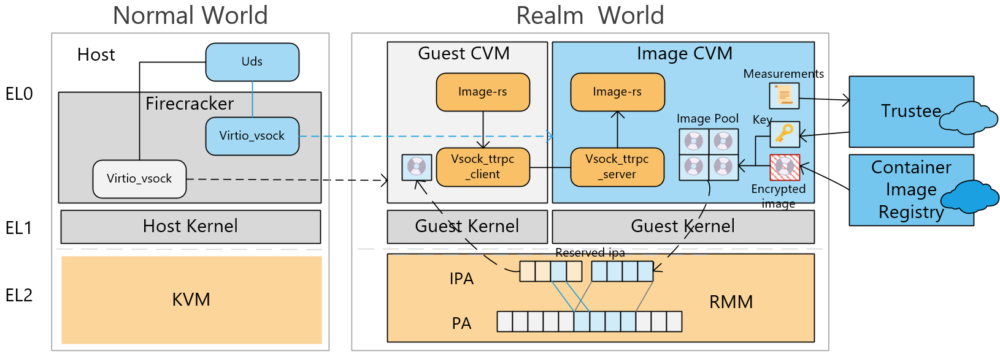
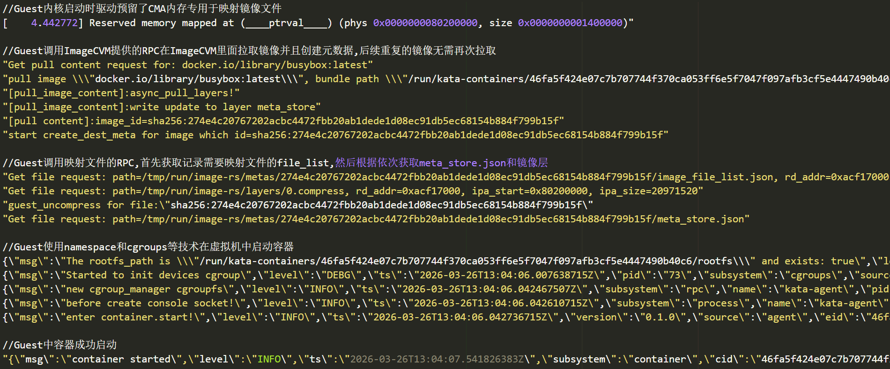

# 基于GPC的容器镜像缓存机制

# 一. 系统概述



项目阶段二交付的基于MicroVM的机密容器镜像快速共享机制的系统架构如上图。

下文将对系统中的核心组件的功能、流程进行概述：

## 1. 核心组件和概念

### (1). Firecracker

Firecracker是由AWS开源的针对无服务器计算场景的轻量级VMM，只实现运行轻量级虚拟机所需的最小设备仿真与虚拟机配置，从而降低复杂VMM功能带来的系统开销。

### (2). KVM

KVM（Kernel-based Virtual Machine）是一种开源的全虚拟化技术，运行在ARM架构中的EL2特权级，作为Linux内核的一部分实现虚拟化控制功能。KVM依托底层CPU的硬件虚拟化扩展（如ARM Virtualization Extensions），通过内核模块的形式将Linux转化为一个Type-1级别的Hypervisor，使其能够在同一物理平台上并行运行多个独立的虚拟机。每个虚拟机在用户空间由VMM（如Firecracker）进行管理和设备仿真，而KVM内核部分负责虚拟CPU调度、内存映射、陷入处理和中断转发等关键虚拟化任务。KVM以虚拟机为资源管理的基本单元，将物理CPU、内存和I/O设备等系统资源划分并安全地分配给不同的虚拟机，同时确保它们之间的执行隔离与性能平衡。

### (3). RMM

RMM（Realm Management Monitor）是ARM Confidential Compute Architecture（CCA）中运行于R-EL2特权级的关键固件组件，负责管理Realm世界的执行环境。其主要功能包括Realm虚拟机的创建、销毁与上下文切换，Realm内存空间的映射与隔离控制，以及通过RMI（Realm Management Interface）为普通世界的虚拟化管理层（如KVM）提供受控访问接口。RMM通过维护Realm Translation Table（RTT）和Realm IPA State（RIPAS）来实现对物理内存访问状态的精确管理，并确保不同安全域之间的内存隔离。该组件由可信固件加载和度量，在系统启动阶段经由安全引导（Secure Boot）机制验证完整性，其设计目标是在不信任宿主Hypervisor的前提下，为机密虚拟机（Realm VMs）提供硬件级的隔离与可信执行环境。

RMM 通过维护 Realm Translation Table（RTT） 和 Realm IPA State（RIPAS） 来管理 Realm 虚拟机的内存。其中，IPA（Intermediate Physical Address） 是 Realm 虚拟机中的虚拟机物理地址，RMM 使用 RTT 将这些 IPA 映射到宿主机的实际物理地址（HPA），以实现对内存访问的精确控制和隔离。RIPAS 用于表示在 Realm 虚拟机视角下各个内存页的状态，用于描述该页是否可访问及其生命周期。例如，RAM 表示该页已分配且可供 Realm 使用；EMPTY 表示该页尚未分配或已被释放，从 Realm 的角度看，这是一块空的、可用的地址范围，Realm 无法访问；DESTROY 表示该页已被永久销毁，既不能被访问，也无法重新分配为 RAM 类型。
利用 RMM（Realm Management Monitor） 的内存管理机制，系统在多个 CVM（Confidential Virtual Machine） 之间实现了安全、可控的内存共享功能。在确保两个 CVM 对同一物理内存区域访问的线程安全前提下，RMM 可以通过修改相应的 stage-2 页表映射关系，将该内存页同时映射到两个 CVM 的地址空间中。RMM 负责维护该共享页的访问权限与可见性，确保映射的建立、撤销及权限变更均在可信路径内完成，从而防止宿主 Hypervisor 或其他未授权实体干扰共享过程。通过这种机制，系统能够在硬件层面支持 CVM 之间的安全数据交换或协同计算，在保持机密性和完整性隔离的同时，实现受控的高效共享。

### (4). Virtio Vsock

Virtio Vsock是一种基于Virtio框架的虚拟化通信设备，用于在宿主机（Host）与虚拟机（Guest）之间，或虚拟机之间建立高效的双向通信通道。该设备通过Virtio抽象层在虚拟化环境中实现统一的驱动接口，其设计目标是提供一种不依赖传统网络协议栈（如TCP/IP）的低开销通信机制。Vsock设备使用面向连接的Socket接口（AF_VSOCK），语义上接近Unix域套接字，但扩展支持跨虚拟化边界的通信。其寻址方式由一对唯一的标识符组成，即CID（Context ID）和端口号，其中CID用于标识通信的端点（如宿主或特定虚拟机），端口号用于区分不同的应用服务。Virtio Vsock在底层通过virtqueue实现数据的发送与接收，Guest侧vsock driver与Host侧的vsock模拟设备（如virtio-vsock）协同工作，负责数据缓冲区的共享与事件通知。该机制广泛用于无需网络配置的宿主机与Guest通信场景，例如agent通信、RPC调用、文件传输及控制命令下发等，在保持通信低延迟的同时兼顾了虚拟化系统的隔离性与安全性。
在Firecracker中，Virtio Vsock相较于传统的Virtio Vsock实现进行了架构级的简化与隔离优化，其核心区别在于宿主机侧不再使用AF_VSOCK接口与Guest进行通信，而是改为通过Unix Socket（AF_UNIX）实现数据交互。传统的Virtio Vsock通常依赖内核的vhost-vsock模块和AF_VSOCK协议栈，由内核负责Virtio队列与宿主机应用之间的数据转发，而Firecracker则完全在用户态中实现Vsock设备逻辑，所有数据路径都在Firecracker进程内部完成。Guest侧的Virtio Vsock驱动通过Virtio队列发送或接收数据，Firecracker进程在用户态拦截这些请求，并将其转发到绑定的Unix Socket，从而与宿主机中的代理程序或服务进行通信。这种设计使得Firecracker无需依赖内核级vsock驱动，减少了信任边界和潜在攻击面，符合Firecracker追求“最小化特权、用户态隔离和高可验证性”的虚拟化设计理念。

### (5). Vsock ttrpc client，Vsock ttrpc server

Vsock ttrpc client 和 Vsock ttrpc server 是基于 Virtio Vsock 设备与 ttrpc（Tiny Transport RPC） 协议构建的高效轻量级通信组件，主要用于虚拟机之间的远程过程调用（RPC）交互。该机制利用Virtio Vsock提供的无网络栈、低延迟的通信通道，实现点对点的消息传输，而ttrpc负责在此基础上定义请求与响应的序列化格式、方法调用语义及错误处理逻辑。与传统的gRPC相比，ttrpc采用简化的消息封装与无HTTP层传输设计，显著降低了序列化与上下文切换的开销，适合运行在高性能要求的虚拟化或机密计算环境中。

### (6). Image CVM，Guest CVM

Guest CVM 是运行实际容器工作负载的机密虚拟机，在容器镜像快速共享机制中充当镜像请求与使用方。在传统的 CoCo 环境中，运行机密容器的 CVM 需要直接从远程仓库拉取容器镜像；而在本系统中，Guest CVM 通过 RMM提供的内存映射机制，从 Image CVM 安全地获取所需的容器镜像数据，实现镜像的快速加载与受控访问。

Image CVM 是该机制中的镜像存储与分发方，负责从远程镜像仓库拉取、解密并验证容器镜像的完整性，然后通过 RMM 的内存共享机制将处理后的镜像内容安全地映射并共享给多个经认证的 Guest CVM。这种设计避免了重复的镜像下载与解密操作，在确保镜像机密性与完整性的同时，显著提升了机密容器的启动效率与系统整体资源利用率。

### (7). Image-rs

Image-rs 是一个用 Rust 编写的容器镜像管理库，运行在 CVM（Confidential VM） 内部，主要负责在受信任环境中执行镜像的拉取、验证、解密与解包等操作，并将处理后的镜像内容提供给容器运行时使用。

## 2.工作流程概述

容器镜像快速共享机制中，Image CVM 通过 Image-rs 从远程仓库拉取并解密镜像；Guest CVM 同样运行 Image-rs，但其主要职责是发起镜像请求。Guest CVM 中的 Image-rs 会通过 Vsock ttrpc client 与 Image CVM 中的 Vsock ttrpc server 建立通信连接，并通过 RPC 调用将镜像拉取与解密任务委托给 Image CVM 执行。当 Image CVM 完成指定镜像的拉取与解密后，系统利用 RMM 的安全内存共享机制，将包含镜像数据的内存区域从 Image CVM 安全映射到 Guest CVM。Guest CVM 随后即可在本地访问这块共享内存，从而快速、安全地获取容器镜像内容，避免了重复的网络下载与解密开销。

# 二. 详细设计

## 1. 基于Virtio Vsock设备构建ttrpc服务的设计

### (1). 修改Virtio Vsock以支持CVM之间的通信


目前Firecracker的Virtio Vsock设备只支持CVM和Host之间的通信。Firecracker 中 Virtio Vsock 的模拟逻辑如上图所示。其中，Driver 位于 Guest CVM 内部，作为 Virtio Vsock 的驱动组件，负责为 Guest 系统提供 Vsock 套接字创建、连接管理以及数据包的发送与接收等功能。Driver 通过 Virtio Queue 与由 Firecracker 模拟的 Vsock Device 进行数据交互。Vsock Device 运行在 Firecracker 进程中，负责接收来自 Guest 侧 Driver 的数据包并将其转发至宿主机（Host）。Firecracker 的 Vsock Device 并未直接使用内核的 AF_VSOCK 接口，而是通过 Unix Domain Socket（UDS） 与宿主应用程序（Host App）建立连接。


为了支持 CVM 与 CVM 之间的直接通信，本系统对 Firecracker 中 Virtio Vsock 设备的模拟逻辑进行了扩展与修改。如上图所示，图中左侧展示了原始 Firecracker 中 CVM 与宿主机（Host） 之间的通信流程，而右侧则展示了修改后 CVM 间通信 的实现机制。

在左侧的传统设计中，Vsock Device 通过 Virtio Queue 与 Guest 内部的 Vsock Driver 进行数据交换，随后将数据转发至宿主机端，通过与 Host App 建立的 Uds 进行传输。而在右侧的改进方案中，CVM1 的 Vsock Device 不再仅与宿主机通信，而是通过连接 另一台 CVM2 的 UDS 建立数据流通道（stream）。该 stream 与 CVM1 的 Virtio Queue 相连，使得来自 CVM1 Vsock Driver 的数据能够通过 Vsock Device 转发 到 CVM2，实现两个 CVM 之间的安全高效通信。这一修改实现了在不依赖宿主机网络协议栈的前提下，CVM 间点对点的低延迟通信，为后续的镜像共享与可信通道建立提供了基础。

### (2). 构建基于Vsock通信的ttrpc服务

通过 Virtio Vsock 通道，底层仅能实现 原始二进制流（byte stream） 的传输，因此并不具备消息边界、序列化或方法调用的语义。为在 Guest CVM 与 Image CVM 之间实现高效且结构化的通信，系统在 Vsock 之上引入了 ttrpc 协议，将二进制流封装为带有消息边界的 RPC 调用，从而提供完整的请求-响应机制和方法调用语义。

具体实现上，系统基于 ttrpc-rust 库构建了 Vsock ttrpc client 与 Vsock ttrpc server，利用了 Virtio Vsock 的低延迟、用户态隔离特性，同时通过 ttrpc 实现类型安全、消息边界清晰的高效远程过程调用。其中，Vsock ttrpc server 部署在 Image CVM 上，提供镜像共享相关的 RPC 服务；Vsock ttrpc client 运行在 Guest CVM 的Image-rs组件中，通过连接 Image CVM 的 ttrpc server 发起 RPC 调用，从而完成容器镜像的获取与使用。

## 2. 基于RMM的CVM镜像共享机制

### (1)通过映射内存在CVM之间快速共享文件的实现


通过映射内存在CVM之间快速共享数据的RSI调用通过RMM实现，通过预留内存并且在stage-2页表中建立映射共享内存，从而交换数据。通过映射内存在CVM之间快速交换数据的详细设计如下。

**1.预留连续的IPA空间**

如图所示，系统在初始化阶段为所有 CVM 预先分配了一段专用的预留内存区域，用于在不同 CVM 之间进行内存映射和数据交换。在 ARM 架构环境下，该预留内存通过 Linux 内核的 Contiguous Memory Allocator（CMA） 机制实现。CMA 会在系统启动时划出一块连续的物理内存作为 CMA 区域，以供需要连续物理地址空间的设备或虚拟机使用。当系统中没有设备占用该区域时，内核会临时将其中的内存页分配给普通内核使用；而当设备驱动（或 CVM 内存映射机制）请求分配连续物理内存时，内核会将 CMA 区域中被占用的页迁移至其他位置，从而释放出一段满足请求大小的连续物理内存块。借助 CMA 机制，系统能够在不破坏整体内存碎片管理的前提下，为每个 CVM 提供足够大、物理地址连续且可控的预留内存空间，用于后续通过 RMM 内存映射机制 实现安全高效的跨 CVM 数据共享。

**2.映射物理内存**
Image CVM 负责发起 RSI（Realm Service Interface） 调用，将自身预留的 IPA 区域对应的HPA（Host Physical Address）映射到指定 Guest CVM 的 IPA 地址空间中，从而在保证线程安全的前提下，实现两者之间的安全内存共享。在该共享机制中，Guest CVM 可以以只读方式访问这段连续的共享物理内存块，从而获取 Image CVM 中的镜像数据或其他共享内容。

具体过程为：当 Image CVM 调用 RSI 请求共享内存时，控制权切换至 RMM。RMM 首先根据 RSI 请求中携带的 RD_ADDR(Realm Descriptor Address) 定位到目标 Guest CVM 的 stage-2 页表；随后，从 Image CVM 的 stage-2 页表中查找其预留 IPA 区域所对应的连续 HPA 物理块地址。RMM 以这些物理块地址为基础，在 Guest CVM 的 stage-2 页表中创建相应的 RTT条目，从而完成 HPA 到 Guest IPA 的映射。

映射完成后，Guest CVM 的驱动程序会将这段预留的 IPA 区域以只读方式映射到自身的 GPA（Guest Physical Address） 空间中，进而能够安全、无拷贝地访问 Image CVM 内存中的共享数据，实现高效的镜像读取与共享操作。

**3.基于映射内存的文件传输**

在具备通过 RMM 实现跨 CVM 内存映射的机制基础上，系统利用该能力实现了高效、安全的文件传输流程。具体而言，Image CVM 在驱动层中将待共享的镜像文件内容加载至其预留的连续物理内存区域中，并通过 RSI 调用 请求 RMM 将这段物理内存映射到目标 Guest CVM 的地址空间。RMM 在完成映射后，会在两个 CVM 的 stage-2 页表中建立一致的映射关系，从而使 Guest CVM 能够以只读方式访问 Image CVM 中的镜像数据。映射操作完成后，Image CVM 通过 Virtio Vsock 向 Guest CVM 发送通知，指示数据已经准备就绪。Guest CVM 接收到通知后，从自身地址空间中对应的预留内存区域读取数据并写入本地文件系统，从而完成整个文件传输过程。该机制避免了传统基于网络或管道的中间数据复制操作，显著降低了传输延迟与内存开销，同时确保了数据在机密计算环境中的安全性与一致性。

### (2)基于映射内存共享文件的机制实现镜像快速共享机制

Image CVM在拉取容器镜像之后需要先进行解密获取镜像的元数据文件meta_store.json以及镜像层文件并且存储在本地，而Guest CVM只需要获取到上述文件就可以满足运行容器的条件。因此实现镜像的快速共享只需要通过内存映射的方式让Guest CVM从Image CVM获取到目标镜像的对应镜像文件。容器镜像的快速共享机制详细设计如下。

**1.Guest CVM请求获取Image id**


当 Guest CVM 需要启动某个容器镜像时，其首要任务是将用户提供的、可能产生歧义的镜像引用（Image URL）解析为一个唯一的、不可变的镜像标识符（Image ID）。获取此 Image ID 是保障容器部署具备确定性、安全性和可追溯性的关键步骤，因为它代表了镜像内容的加密指纹，能确保在任何时间、任何地点启动的都是完全相同的软件构件。

为完成这一解析过程，如图所示：

①Guest CVM 会通过其内部的镜像管理组件 Image-rs 向Image CVM发起请求。Image-rs 作为客户端，通过 Vsock 安全通信通道并利用 ttrpc 协议，向运行在 Image CVM 中的 Vsock ttrpc server 发送一个远程调用。该请求的核心目的便是获取目标镜像的 Image ID，其请求负载包含关键字段：

- Image URL：标识 Guest CVM 需要加载的目标镜像，例如 "busybox:latest"。

②当 Image CVM 接收到来自 Guest CVM 的镜像请求后，会通过外部网络接口向远程镜像仓库发起 API 调用，获取与请求中所包含的 Image URL 对应的 Image Manifest。该 Manifest 文件是镜像的核心元数据描述，详细记录了镜像构成所需的层（layers）、配置文件及其依赖关系。

③Image CVM 在受信任的执行环境中接收并解析完整的 Manifest 文件后，对其内容执行 SHA256 哈希计算，所得哈希值即为该镜像版本的唯一标识符Image ID。这种基于内容寻址的标识机制确保了镜像在后续传输与共享过程中的一致性和防篡改性。

④Image CVM 按照 Manifest 中定义的层次结构，从远程镜像仓库依次拉取各个镜像层文件（layer blobs），并在机密环境下执行完整性验证与解密操作，确保镜像数据在传输与存储过程中均保持可信和机密。验证通过的镜像层被安全地存储至 Image CVM 的文件系统中，作为后续供 Guest CVM 加载使用的基础镜像数据源。

⑤在镜像下载与处理完成后，Image CVM 会生成包含该镜像启动所需文件信息的 JSON 文件，命名为 Image_file_list，其中详细列出了镜像层路径及其相关元数据。该文件路径在系统设计中由常量预定义，并与 Guest CVM 约定达成一致，从而使 Guest CVM 在获取到 Image ID 后，能够通过字符串拼接的方式直接定位到对应的 Image_file_list 文件，进而获取镜像文件的具体信息。

⑥最终，Image CVM 将包含 Image ID 的 ttrpc 响应消息返回给 Guest CVM。

2**.Guest CVM请求映射镜像启动所需文件**
在得到Image ID之后，Guest CVM需要向Image CVM请求获取容器启动所需的所有镜像文件。


为完成这一请求过程，如图所示：

①当 Guest CVM 获得镜像对应的 Image ID 后，首先通过字符串拼接的方式构造出该镜像在 Image CVM 上的Image_file_list文件路径，并通过 Vsock ttrpc client 向 Image CVM 发起请求以获取该文件。Image_file_list是由 Image CVM 在镜像解密与验证阶段生成的描述文件，记录了镜像启动所需的各个文件信息及其在 Image CVM 文件系统中的路径。

②Guest CVM 在接收到并解析该文件后，能够获取完整的镜像层级结构及每个文件的物理位置。随后，Guest CVM 根据解析得到的文件路径，逐一向 Image CVM 发起映射请求。Image CVM 在接收到映射请求后，将对应的镜像层文件加载至其预留内存区域，并通过 RSI 调用实现与 Guest CVM 的内存共享映射。映射完成后，Guest CVM 从共享内存中读取镜像文件数据并写入本地文件系统。至此，镜像传输过程结束，Guest CVM 已具备运行该镜像所需的全部文件资源，可在容器运行时环境中安全启动并执行目标容器。

# 三. 代码实现

## 1. Firecracker中Virtio Vsock设备的修改

Firecracker对Virtio Vsock设备的修改主要在`Firecracker-CCA/src/vmm/src/devices/virtio/vsock/unix/muxer.rs`中，muxer.rs主要负责建立Host App和Vsock Device之间的连接，其中`handle_peer_request_pkt`函数负责处理CVM中Vsock Driver向Host发起的连接请求，并且将连接的另一端接入到Uds即Host的Unix Socket上。假设CVM1通过Vsock Driver向Host发送连接请求，想要连接到CVM2，将连接Unix Socket的逻辑改为目标CVM即CVM2的Uds，从而让CVM1的Vsock Device的另一端直接连接到CVM2的Vsock Driver，从而实现在CVM之间通过Virt Vsock传输数据的功能。具体修改代码如下：

```rust
  let dst_vsock_path = format!("/tmp/v{}sock", pkt.hdr.dst_cid());
  let command = format!("connect {}\n", pkt.hdr.dst_port());
  let mut accept_buf = [0u8; 1024];
  //Guest CVM的Vsock Device创建UnixStream连接Image CVM对应的的Uds
  let mut stream = UnixStream::connect(dst_vsock_path)
      .map_err(VsockUnixBackendError::UnixConnect)
      .and_then(|mut stream| {
		      //写入CONNECT {port}，正式发起连接
          stream
              .write_all(command.as_bytes())
              .map(|_| stream)
              .map_err(VsockUnixBackendError::UnixConnect)
      })
      .unwrap();
  //读取连接确认的响应
  stream
      .read(&mut accept_buf)
      .expect("fail to get uds response");
  //设定stream为非阻塞
  stream
      .set_nonblocking(true)
      .map_err(VsockUnixBackendError::UnixConnect)
      .unwrap_or_else(|_| self.enq_rst(pkt.hdr.dst_port(), pkt.hdr.src_port()));
	//在Guest CVM的连接池中加入
	//从Guest CVM Driver-Guest CVM Device到Image CVM device-Image CVM Driver的连接
  self.add_connection(
      ConnMapKey {
          local_port: pkt.hdr.dst_port(),
          peer_port: pkt.hdr.src_port(),
      },
      MuxerConnection::new_peer_init(
          stream,
          uapi::VSOCK_HOST_CID,
          self.cid,
          pkt.hdr.dst_port(),
          pkt.hdr.src_port(),
          pkt.hdr.buf_alloc(),
      ),
  )
  .unwrap_or_else(|_| self.enq_rst(pkt.hdr.dst_port(), pkt.hdr.src_port()));
}
```

## 2.Realm预留连续IPA空间

系统使用linux内核提供的CMA机制为CVM预留IPA空间，ARM架构下需要通过设备树指定CMA区域，内核启动时会解析设备树并且划分相应的CMA预留空间。而Firecracker启动Realm虚拟机使用了代码生成的设备树，因此需要修改Firecracker相关代码，主要改动如下。

在 `Firecracker-CCA/src/vmm/src/arch/aarch64/layout.rs` 文件中，系统对 CVM（Confidential VM） 的内存布局进行了重新定义，以适配机密计算环境下的安全隔离与内存共享需求。具体而言，整个内存空间从 4 GB 地址处开始划分：首先分配一块大小为 2 MB 的区域，用于存放系统 ACPI 表 以及部分关键虚拟设备的内存映射空间，这部分区域通常由固件或虚拟化层在启动阶段初始化；紧随其后的是一块专用于内存映射共享的预留区域，该区域由系统在启动阶段静态划定，供 RMM进行跨 CVM 的物理内存映射操作使用，用于实现数据传输；最后的剩余部分则作为 CVM 操作系统的可用内存区域，供内核与用户态进程正常分配与使用。`layout.rs` 中队预留内存区域的地址和大小定义如下：

```rust
//预留IPA区域的起始地址
pub const RESERVERD_MEM_START: u64 =SYSTEM_MEM_START+SYSTEM_MEM_SIZE;

//预留IPA区域的大小
pub const RESERVERD_MEM_SIZE:u64=0x140_0000;
```

在 `Firecracker-CCA/src/vmm/src/arch/aarch64/fdt.rs` 中，为了在 Firecracker 生成的设备树（FDT, Flattened Device Tree）中描述并暴露 CMA 预留内存区域，系统在设备树构建逻辑中新增了 `reserved_memory_node` 的生成代码。该节点命名为 **`reserved-memory`**，其地址范围由常量 `RESERVED_MEM_START` 和 `RESERVED_MEM_SIZE` 决定，即从 `RESERVED_MEM_START` 开始至 `RESERVED_MEM_START + RESERVED_MEM_SIZE` 结束。节点属性中添加了 **`#address-cells`** 与 **`#size-cells`**，用于指示地址与大小字段的字节宽度，并设置 `ranges` 属性以定义物理地址映射范围。在该节点下创建了一个名为 **`cma@<RESERVED_MEM_START>`** 的子节点，并在其属性中声明了 `reg`（表示物理起始地址与长度），`compatible = "shared-dma-pool"`（表示该区域可供驱动共享使用）以及 **`linux,cma-default`**（指定该区域为内核默认的 CMA 区域）。同时，增加了 **`no-map`** 属性，用于指示 Linux 内核在启动阶段不要主动将该区域映射到内核的虚拟地址空间中，从而保持该物理内存的独立性与可控性，避免影响后续由 RMM 管理的内存映射行为。具体生成该部分设备树的代码如下：

```
fn create_reserverd_memory_node(fdt:&mut FdtWriter,guest_mem:&GuestMemoryMmap)->Result<(),FdtError>{
    let reserved_mem_size= super::layout::RESERVERD_MEM_SIZE;
    //确保预留区域的IPA合法性
    assert!(super::layout::RESERVERD_MEM_START % 0x20_0000 == 0, "reserved_start must be 2MB-aligned");
    assert!(super::layout::RESERVERD_MEM_SIZE % 0x20_0000 == 0, "reserved_size must be 2MB-aligned");
    let reserved_mem_reg_prop = &[
        0x0,
        super::layout::RESERVERD_MEM_START,
        0x0,
        reserved_mem_size,
    ];
    //在firecracker启动CVM使用的设备树中创建设备树节点
    let reserved_mem=fdt.begin_node("reserved-memory")?;
    fdt.property_u32("#address-cells", 2)?;
    fdt.property_u32("#size-cells", 2)?;
    fdt.property_null("ranges")?;
    let reserved_region_name=format!("reserved_region@{:x}", super::layout::RESERVERD_MEM_START);
    let reserved_region = fdt.begin_node(&reserved_region_name)?;
    fdt.property_string("compatible", "shared-dma-pool")?;
    fdt.property_array_u64("reg", reserved_mem_reg_prop)?;
    fdt.property_null("no-map")?;
    fdt.end_node(reserved_region)?;
    fdt.end_node(reserved_mem)?;
    Ok(())
}

```

在 CCA 环境下发现的实际问题是：当内核对一段连续 IPA 调用 `memremap` 以便在内核虚拟地址空间中访问时，RME 对 `memremap` 的 hook 会依据该 IPA 的 RIPAS 状态决定映射后的属性 —— 若该 IPA 不是 DEV 状态，映射完成后会被转换为 NS（Normal-world）可访问的内存，从而破坏机密性并使后续的映射不可被信任。为了解决这一问题，我们对内核中 RME 对 `memremap` 的 hook 中判定是否为受保护的MMIO的函数__arm64_is_protected_mmio进行了修改，使得在设备树中被定义为 CMA / reserved-memory 的预留内存在 RME 中被默认视作 **DEV** 状态内存：实现思路是在 RME 初始化阶段读取并缓存 device-tree 中 `reserved-memory`/`cma@...` 节点的地址范围。然后在`__arm64_is_protected_mmio`被触发时先检测目标物理地址是否落在这些已知的 CMA 区间内；若落入则认为该片区域受保护的MMIO地址，从而在保持 CMA 预留内存在 CCA 环境中的安全性和可用性。具体代码在`linux/arch/arm64/kernel/rsi.c` 中。

```
bool __arm64_is_protected_mmio(phys_addr_t base, size_t size)
{
	enum ripas ripas;
	phys_addr_t end, top;
	//指定预留内存区域为受保护的mmio区域
	if (base >=RESERVED_MEM_START && base + size <= RESERVED_MEM_START + RESERVED_MEM_SIZE) {
		return true;
	}
	/* Overflow ? */
	if (WARN_ON(base + size <= base))
		return false;

	end = ALIGN(base + size, RSI_GRANULE_SIZE);
	base = ALIGN_DOWN(base, RSI_GRANULE_SIZE);

	while (base < end) {
		if (WARN_ON(rsi_ipa_state_get(base, end, &ripas, &top)))
			break;
		if (WARN_ON(top <= base))
			break;
		if (ripas != RSI_RIPAS_DEV)
			break;
		base = top;
	}

	return base >= end;
}

static int realm_ioremap_hook(phys_addr_t phys, size_t size, pgprot_t *prot)
{
	if (__arm64_is_protected_mmio(phys, size))
		*prot = pgprot_encrypted(*prot);
	else
		*prot = pgprot_decrypted(*prot);

	return 0;
}
```

最终，通过内核模块将预留的IPA空间映射至内核虚拟地址空间，实现了对预留内存区域的直接读写访问与控制，为CVM间的数据交换提供了高效且可管理的内存操作接口。具体代码在`linux/drivers/image-server/image-server.c` 中。

```c
//利用memremap映射IPA到内核的虚拟地址空间
reserved_mem =
		memremap(RESERVED_MEM_PHYS, RESERVED_MEM_SIZE, MEMREMAP_WB);
if (!reserved_mem) {
	pr_err("Failed to memremap reserved memory\n");
	return -ENOMEM;
}
```

## 3.通过内存映射传输文件

在 RMM 框架内，通过对目标 Guest CVM 的 **stage-2** 页表进行修改，实现了将 Guest CVM 的 IPA 映射到 Image CVM 中对应 IPA 所指向的 HPA 的能力；映射文件的流程为：Image CVM 在接收到包含目标 Guest 的预留 IPA 基址与长度以及目标 Realm 标识 `RD_ADDR` 的 RSI 请求后，首先在自身的 stage-2 页表中解析出该预留 IPA 区域所对应的连续 HPA 物理块列表，然后依据请求中携带的 `RD_ADDR` 定位到目标 Guest CVM 的 stage-2 数据结构并在其对应的 IPA 地址范围内创建相应的 RTT/页表条目，将这些 HPA 物理块映射到目标 Guest 的 IPA 空间中；在完成映射时实现必要的 RIPAS 状态更新为RAM类型、页表与缓存一致性维护及 TLB 同步，以确保映射对两端均可见且安全可靠，从而完成基于 RMM 的 CVM 间内存映射与共享。具体代码在`tf-rmm/runtime/rsi/rsi_image.c`：

```
 //对预留IPA的每一页进行以下操作，直到指定大小
 while (map_size > 0)
    {
        //获得Image CVM预留内存区域IPA对应的HPA
        status = realm_ipa_to_pa(rec, image_ipa, &result);
        if (status == WALK_SUCCESS)
        {
            image_pa = result.pa;
            granule_unlock(result.llt);
        }
        else if (status == WALK_FAIL)
        {
            rmm_log("WALK FAIL\n");
            rmm_log("Failed to get pa for ipa: %#lx, %d\n", image_ipa, status);
            rmm_log("state of the failed ipa:%d", result.ripas_val);
            res->smc_res.x[0] = RSI_ERROR_INPUT;
            return;
        }
        else
        {
            rmm_log("WALK_INVALID_PARAMS\n");
            res->smc_res.x[0] = RSI_ERROR_INPUT;
            return;
        }
        //获取Guest CVM的RTT锁
        granule_lock(guest_s2_ctx->g_rtt, GRANULE_STATE_RTT);
        //获取Guest CVM指定IPA地址的RTT条目
        s2tt_walk_lock_unlock(guest_s2_ctx, guest_ipa, S2TT_PAGE_LEVEL, &wi);
        //映射该RTT结果到ll_table
        ll_table = buffer_granule_map(wi.g_llt, SLOT_RTT);
        assert(ll_table != NULL);
        s2tt_invalidate_page(guest_s2_ctx, guest_ipa);
        //创建RTT条目，指定映射该IPA到Image CVM的IPA对应的HPA，内存状态指定为ASSIGNED RAM
        s2tte = s2tte_create_assigned_ram(guest_s2_ctx, image_pa, S2TT_PAGE_LEVEL);
        if (!s2tte)
        {
            rmm_log("Failed to create_assigned_ram for : %#lx, %d\n", image_ipa, status);
            res->smc_res.x[0] = RSI_ERROR_INPUT;
            return;
        }
        //将刚刚创建的RTT条目写入Guest CVM的stage-2表中
        s2tte_write(&ll_table[wi.index], s2tte);
        granule_unlock(wi.g_llt);
        buffer_unmap(ll_table);
        rmm_log("successfully map mem from image cvm to guest(size=%lu) ipa: %#lx pa: %#lx to ipa: %#lx\n",
                map_size,
                image_ipa,
                image_pa,
                guest_ipa);
        if (map_size < A_PAGE_SIZE)
            break;
        image_ipa += A_PAGE_SIZE;
        guest_ipa += A_PAGE_SIZE;
        map_size -= A_PAGE_SIZE;
    }
```

在前述已构建的CVM间内存映射机制基础上，进一步实现了一个内核模块，用于封装RSI调用逻辑并集成文件读写操作。该模块能够通过RSI接口完成映射内存的创建与回收，同时支持将文件内容高效地读入或写出到映射区域，从而实现CVM之间基于共享内存的高速文件传输。其主要接口设计如下所示：

```cpp
//获取CVM对应的RD_ADDR
int get_rd_addr(unsigned long *rd_addr);
//映射CVM的内存到指定CVM
int map_mem(unsigned long guest_rd_addr, unsigned long guest_ipa,
	    unsigned long map_size);
//初始化预留内存（映射IPA到内核虚拟地址空间）
int reserved_init(void);
//加载文件到预留内存
int load_file(struct load_file_data *load_file_request);
//将预留内存的数据写入到文件
int write_file(struct write_file_data *write_file_request);
```

## 4. 基于Virtio Vsock传输构建ttrpc服务实现镜像共享服务

系统在 Virtio Vsock 之上构建了基于 **ttrpc** 的镜像共享服务，并采用异步处理模型以提高并发性与响应性；该服务运行在 **Image CVM** 内，暴露给 Guest CVM 的主要 RPC 接口包括 `GetImageID` 与 `GetFile`。`GetImageID` 接口接收来自 Guest 的 `image_url`，由 Image CVM 在受信任环境中解析该 URL、向远程仓库请求并下载对应的 Image Manifest 与层文件、在本地完成完整性验证与解密处理，基于 Manifest 内容计算并生成基于 SHA256 的 Image ID，同时在文件系统中构建并持久化镜像文件清单（Image_file_list），最终将 Image ID 异步返回给调用方以供后续定位与拉取；`GetFile` 接口用于按需将镜像启动所需的具体文件从 Image CVM 传递给指定的 Guest CVM，调用时客户端提供目标 Guest 的标识与预留 IPA 区域信息，Image CVM 会把目标文件加载到自身预留的连续物理内存区，随后通过封装的 RSI 调用请求 RMM 在目标 Guest 的 stage-2 页表中创建 IPA→HPA 映射，并在映射完成后通过 Vsock/ttrpc 的异步通知机制告知 Guest，Guest 随后可从其本地映射的 IPA 区域中读取数据完成文件写入。具体代码在`guest-components/confidential-data-hub/hub/src/bin/vsock-ttrpc-server.rs` 和`guest-components/image-rs/src/vsock_ttrpc_client`中。

```toml
syntax = "proto3";

package image;

service ImageService {
  //请求Image CVM拉取镜像，并且获取Image ID
  rpc get_image_id(GetImageIdRequest) returns (GetImageIdResponse);
  //映射Image CVM指定路径的文件数据到Guest CVM的预留内存
  rpc get_file(GetFileRpcRequest) returns (GetFileResponse);
}

message GetImageIdRequest { string image_url = 1; }

message GetImageIdResponse { string image_id = 1; }

message GetFileRpcRequest {
  uint64 rd_addr = 1;
  uint64 ipa_start = 2;
  uint64 ipa_size = 3;
  string file_path = 4;
}

message GetFileResponse { uint64 size = 1; }
```

基于上述两个 RPC 接口，Guest CVM 可以以流式、按需的方式完成镜像的获取与加载流程。具体而言，Guest CVM 首先通过调用 `get_image_id` 接口，向 Image CVM 请求解析指定的镜像 URL，并在获得对应的 `image_id` 后，以此作为后续文件定位与访问的全局标识。随后，Guest CVM 通过调用 `get_file` 接口，映射 Image CVM 中与该 `image_id` 关联的镜像文件列表（`Image_file_list`），解析其中记录的镜像层文件及其路径信息。基于这些文件路径，Guest CVM 依次发起对镜像层文件的映射请求，Image CVM 在每次请求中将对应文件内容加载至自身预留内存，并通过 RMM 建立到 Guest CVM 预留 IPA 空间的映射，Guest 端则直接从映射区域读取数据完成文件重建。经过对镜像文件列表中所有文件的逐一映射与加载，Guest CVM 最终获得了构建完整容器镜像所需的全部数据，从而能够在其运行时环境中顺利启动对应的容器实例。

# 四. 实验

在基于 Rock 5B (RK3588) 的硬件平台上，结合 OpenCCA 模拟 Arm Confidential Compute Architecture 执行环境，对本文设计的镜像共享机制与 Kata Containers 原生镜像拉取机制的镜像拉取时间进行了对比评估。测试基准：BusyBox 轻量镜像，单实例启动场景，单位：ms（毫秒），实验结果如下。

实验结果表明，本文设计的镜像共享机制的平均耗时为 3292.25 ms，而 Kata Containers 原生镜像拉取机制的平均耗时为 6091.5 ms。相比之下，所提出的共享机制将平均耗时降低约 45.9%，显著提升了整体执行效率，验证了该方案的性能优势。

在该测试场景中，共享镜像机制通过避免从远端仓库进行镜像拉取，减少了网络传输带来的时间开销；而采用基于内存映射的零拷贝方式获取镜像数据，降低了数据传输的成本，最终实现了更快的镜像启动速度。

| 测试机制 | 第 1 次 | 第 2 次 | 第 3 次 | 第 4 次 | 平均耗时 |
| --- | --- | --- | --- | --- | --- |
| Kata 原生镜像拉取（guest-pull） | 7939 | 5257 | 5403 | 5767 | **6091.5** |
| 本文设计镜像共享机制（guest-share） | 3581 | 4078 | 3267 | 2243 | **3292.25** |

实验截图如下：

1. 启动用于共享镜像的Image-CVM


1. 启动通过Image-CVM拉取镜像的Guest-CVM


