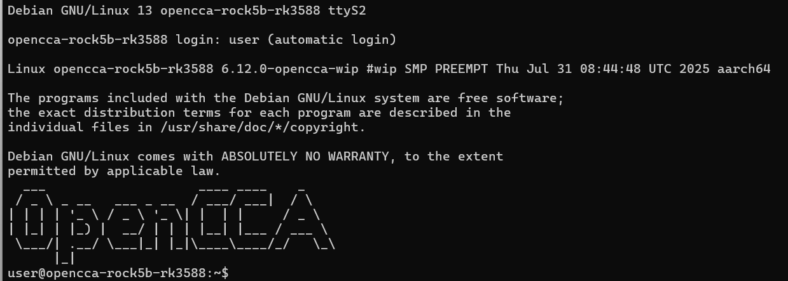

# OPENCCA-RK3588

# 一.编译系统

## 1.编译opencca，刷入系统

```toml
git clone [https://github.com/opencca/opencca-build](https://github.com/opencca/opencca-build)

debian-image-recipes/download-rock5b-opencca-artifacts.sh中将LINUX_BRANCH=opencca/next改为LINUX_BRANCH=opencca/main

opencca-build/buildconf/linux.mk中111与112行加上|| true，否则可能因为目录相同报错

修改SPL Loader

收集了各版本spl loader的仓库：https://github.com/armbian/rkbin/tree/master/rk35

需要修改SPL Loader为1.16版本，官方文档给的1.08版本无法正常初始化内存。

下载rk3588_ddr_lp4_2112MHz_lp5_2400MHz_v1.16.bin与rk3588_spl_loader_v1.16.113.bin

修改opencca-build/buildconf/firmware_opencca.mk：

- UBOOT_ROCKCHIP_TPL := $(ASSETS_DIR)/rk3588/rk3588_ddr_lp4_2112MHz_lp5_2736MHz_v1.08.bin
+ UBOOT_ROCKCHIP_TPL := $(ASSETS_DIR)/rk3588/rk3588_ddr_lp4_2112MHz_lp5_2400MHz_v1.16.bin

将rk3588_spl_loader_v1.16.113.bin复制为opencca-assets/rk3588/rk3588_spl_loader_v1.08.111.bin

随后进入docker编译

cd opencca-build/docker
sudo make start
sudo make enter
 
# Docker
cd opencca-build/scripts
# 不打包文件系统，较快
./build_all.sh
# 打包文件系统，较慢
# ./build_all.sh all
# 打包生成的系统位于debian-image-recipes/out/opencca-image-rockchip-rock5b-rk3588.img.gz
# 生成的系统似乎还是用的v1.08版本spl loader，可以参考下面手动dd刷如1.16版本
```

## 2.修改系统镜像的idbloader和u-boot

```toml
编译后获得snapshot/idbloader.img与snapshot/u-boot.itb

使用dd将两个文件刷入至opencca给的系统镜像中

//写入idbloader和uboot
dd if=~/opencca-work/opencca/snapshot/idbloader.img of=~/opencca-work/rootfs/opencca-image-rockchip-rock5b-rk3588.img seek=64 conv=notrunc;
dd if=~/opencca-work/opencca/snapshot/u-boot.itb of=~/opencca-work/rootfs/opencca-image-rockchip-rock5b-rk3588.img seek=16384 conv=notrunc

这里opencca-image-rockchip-rock5b-rk3588.img可以使用opencca发布的二进制文件版本：
https://github.com/opencca/opencca-releases/releases/download/opencca/systex25/opencca.tar.gz

```

## 3.修改设备树文件

### 挂载系统镜像，提取和写回设备树文件

```toml
sudo losetup -f -P opencca-image-rockchip-rock5b-rk3588.img;

sudo mount /dev/loop0p3 /mnt/opencca_root;

//复制设备树
cp /mnt/opencca_root/usr/lib/linux-image-6.12.0-opencca-wip/rockchip/rk3588-rock-5b.dtb ./rk3588-rock-5b.dtb

//转化为dts格式
dtc -I dtb -O dts -o rk3588.dts rk3588-rock-5b.dtb

//修改dts之后转回dtb文件
dtc -I dts -O dtb -o rk3588-rock-5b.dtb rk3588.dts

//复制dtb回文件系统
cp rk3588-rock-5b.dtb /mnt/opencca_root/usr/lib/linux-image-6.12.0-opencca-wip/rockchip/rk3588-rock-5b.dtb
```

### 设备树

强制只使用3.6V电压模式
`++ no-1-8-v;
 -- sd-uhs-sdr104;`

强制使用基础速率模式,避免进入 high-speed/uhs模式
`max-frequency = <25000000>;`

gpio-sd表示控制器依赖引脚来判断 SD 卡是否插入。
broken-cd 认为本SD卡槽没有插入检测开关，驱动应始终认为卡存在，并直接尝试初始化。
`-- gpio-cd<...>
 ++ broken-cd;`

```
//需要更改设备树节点设置
mmc@fe2c0000 {
	compatible = "rockchip,rk3588-dw-mshc\\0rockchip,rk3288-dw-mshc";
	reg = <0x00 0xfe2c0000 0x00 0x4000>;
	interrupts = <0x00 0xcb 0x04 0x00>;
	clocks = <0x0a 0x17 0x0a 0x09 0x20 0x2ad 0x20 0x2ae>;
	clock-names = "biu\\0ciu\\0ciu-drive\\0ciu-sample";
	fifo-depth = <0x100>;
	max-frequency = <25000000>;
	pinctrl-names = "default";
	pinctrl-0 = <0x85 0x86 0x87 0x88>;
	power-domains = <0x21 0x28>;
	status = "okay";
	no-sdio;
	no-mmc;
	bus-width = <0x04>;
	cap-mmc-highspeed;
	cap-sd-highspeed;
	broken-cd;
	disable-wp;
	no-1-8-v;
	vmmc-supply = <0x8a>;
	vqmmc-supply = <0x8b>;
};

//去除wlan硬件锁
rfkill {
	compatible = "rfkill-gpio";
	label = "rfkill-pcie-wlan";
	radio-type = "wlan";
	shutdown-gpios = <0xf9 0x02 0x01>;
};
```

# 二.连接串口

```toml
SimpleCom.exe COM3 --baud-rate 1500000

SimpleCom.exe COM6 --baud-rate 1500000
```



# 三.网络配置

当前 COCO/RK3588 实验环境：

- RK3588：`192.168.31.18`，SSH `root/root`
- Raspberry Pi 电源/刷机控制机：`192.168.31.52`，SSH `mzh/root`
- 本地 COCO 工作区：`/home/mzh/RK3588/COCO`
- RK3588 远端运行目录：`/root/COCO-SFTP`

### 使用以太网连接，用PC共享网络提供以太网连接

### **让rk3588使用静态ip**

```toml
sudo vim /etc/systemd/network/10-enP4p65s0.network

[Match]
Name=enP4p65s0

[Network]
DHCP=no
Address=192.168.31.18/24
Gateway=192.168.31.1
DNS=192.168.31.1

[Link]
RequiredForOnline=yes

[Route]
Destination=0.0.0.0/0
Gateway=192.168.31.1

sudo systemctl restart systemd-networkd
```

### 初始配置

```go
sudo passwd root
```

### 设置路由

```rust
sudo systemctl restart systemd-networkd

sudo ip route del default
sudo ip route add default via 192.168.31.1 dev enP4p65s0

注意 route 冲突

sudo sh -c 'printf "nameserver 192.168.31.1\n" > /etc/resolv.conf'
```

### APT换源

```rust
sudo mv /etc/apt/sources.list /etc/apt/sources.list.backup

sudo tee /etc/apt/sources.list > /dev/null << 'EOF'
deb [https://mirrors.tuna.tsinghua.edu.cn/debian](https://mirrors.tuna.tsinghua.edu.cn/debian) trixie main contrib non-free
deb [https://mirrors.tuna.tsinghua.edu.cn/debian](https://mirrors.tuna.tsinghua.edu.cn/debian) trixie-updates main contrib non-free
deb [https://mirrors.tuna.tsinghua.edu.cn/debian-security](https://mirrors.tuna.tsinghua.edu.cn/debian-security) trixie-security main contrib non-free
EOF

sudo apt update
```

### 主机名解析问题

```rust
sudo apt install vim
sudo tee /etc/hosts > /dev/null << 'EOF'
****127.0.0.1 localhost opencca-rock5b-rk3588
EOF
```

### 配置ssh

```rust
sudo apt install ssh

sudo mv /etc/ssh/sshd_config /etc/ssh/sshd_config.backup
sudo vim /etc/ssh/sshd_config

#配置如下
sudo tee /etc/ssh/sshd_config > /dev/null << 'EOF'
PasswordAuthentication yes
PermitRootLogin yes
UsePAM yes
PubkeyAuthentication yes
PermitEmptyPasswords no
MaxAuthTries 10
ListenAddress 0.0.0.0
Port 22
Subsystem sftp internal-sftp
EOF

sudo systemctl restart ssh
ssh-keygen -R 192.168.31.18
```

# 四.配置containerd环境

## 1.containerd

```toml
sudo apt install containerd 

/etc/containerd/config.toml
```

## 2.firecracker

```toml
firecracker
```

## 3.kata-container

```bash
export CC=aarch64-linux-musl-gcc
export GOARCH=arm64 GOARM="" CGO_ENABLED=1 CC=aarch64-linux-gnu-gcc && make
cp kata-runtime ~/OPCCA/SFTP_folder/kata-bins/
cp containerd-shim-kata-v2 ~/OPCCA/SFTP_folder/kata-bins/
cp kata-monitor ~/OPCCA/SFTP_folder/kata-bins/

containerd-shim-kata-v2
kata-monitor
kata-runtime
/etc/kata-containers/configuration.toml
```

## 4.Guest Images

```toml
Image
kata-containers-cca.img
```

## 5.配置guest-pull

```bash
export GOARCH=arm64 GOARM="" CGO_ENABLED=1 CC=aarch64-linux-gnu-gcc && make
cp -v ./bin/containerd-guest-pull-grpc ~/OPCCA/SFTP_folder/guest-pull/
cp -v ./bin/guest-pull-overlayfs ~/OPCCA/SFTP_folder/guest-pull/

sudo apt install iptables
sudo ln -sf /usr/sbin/iptables-legacy /usr/sbin/iptables
sudo ln -sf /usr/sbin/ip6tables-legacy /usr/sbin/ip6tables

sudo tee /etc/systemd/system/guest-pull-snapshotter.service > /dev/null <<EOF
[Unit]
Description=Guest-pull snapshotter
After=network.target local-fs.target

[Service]
ExecStart=/usr/local/bin/containerd-guest-pull-grpc

[Install]
WantedBy=multi-user.target
EOF

sudo systemctl daemon-reload

sudo systemctl start guest-pull-snapshotter;

```

## 6.cni组件

```toml
编译cni获得
/opt/cni/bin
```

## *.重新编译内核

```bash
git clone --depth=1 -b opencca/rk3588-v5+v7 [https://github.com/opencca/linux.git](https://github.com/opencca/linux.git)
git clone --depth=1 -b opencca/rk3588-v5+v7 https://githubfast.com/opencca/linux.git
###host上 
cd linux
export ARCH=arm64
export CROSS_COMPILE=aarch64-linux-gnu-

./scripts/kconfig/merge_config.sh arch/arm64/configs/defconfig ./rk3588_fragment.config

make -j16

make modules_install INSTALL_MOD_PATH=../SFTP_folder/debian-kernel;
cp arch/arm64/boot/Image ../SFTP_folder/debian-kernel

###板子上
sudo rm -rf /lib/modules/6.12.0+/
sudo mv /home/user/sftp_folder/debian-kernel/lib/modules/6.12.0+ /lib/modules
sudo mv /home/user/sftp_folder/debian-kernel/Image /boot/vmlinuz-6.12.0-opencca-wip

```

复制内核模块到系统

```bash
sudo losetup -f -P opencca-image-rockchip-rock5b-rk3588.img;
sudo mount /dev/loop0p3 /mnt/opencca_root;

sudo make modules_install INSTALL_MOD_PATH=/mnt/opencca_root;
sudo cp arch/arm64/boot/Image /mnt/opencca_root/boot/
sudo cp ~/opencca-work/rootfs/uboot-rk3588-rock-5b.dtb /mnt/opencca_root/boot

sudo umount  /mnt/opencca_root;
sudo losetup -d /dev/loop0
```

# 五.测试运行

```toml
sudo modprobe overlay
sudo systemctl restart guest-pull-snapshotter
sudo modprobe vsock
sudo modprobe vhost-vsock
sudo modprobe loop
SimpleCom.exe COM3 --baud-rate 1500000

sudo nerdctl run --cgroup-manager=cgroupfs --net coco-bridge --dns 192.168.31.1 --snapshotter guest-pull --annotation "io.kubernetes.cri.image-name=docker.m.daocloud.io/library/busybox:latest" --annotation "io.kata-containers.is-image-cvm=true" --runtime io.containerd.kata.v2 -it docker.m.daocloud.io/library/busybox:latest sh

sudo nerdctl run --cgroup-manager=cgroupfs --net coco-bridge --dns 192.168.31.1 --snapshotter guest-pull --annotation "io.kubernetes.cri.image-name=docker.m.daocloud.io/library/busybox:latest" --annotation "io.kata-containers.is-image-cvm=false" --runtime io.containerd.kata.v2 -it docker.m.daocloud.io/library/busybox:latest sh

sudo nerdctl run --cgroup-manager=cgroupfs --net coco-bridge --dns 192.168.31.1 --snapshotter guest-pull --annotation "io.kubernetes.cri.image-name=docker.m.daocloud.io/library/nginx:latest" --annotation "io.kata-containers.is-image-cvm=true" --runtime io.containerd.kata.v2 -it docker.m.daocloud.io/library/nginx:latest sh

sudo nerdctl run --cgroup-manager=cgroupfs --net coco-bridge --dns 192.168.31.1 --snapshotter guest-pull --annotation "io.kubernetes.cri.image-name=docker.m.daocloud.io/library/nginx:latest" --annotation "io.kata-containers.is-image-cvm=false" --runtime io.containerd.kata.v2 -it docker.m.daocloud.io/library/nginx:latest sh

sudo ctr task list
sudo kata-runtime exec  
 
sudo nerdctl run --cgroup-manager=cgroupfs --net coco-bridge --dns 192.168.31.1 --runtime io.containerd.kata.v2 -it docker.m.daocloud.io/library/busybox:latest sh
 
 
sudo nerdctl stop $(sudo nerdctl ps -a -q)
sudo nerdctl rm $(sudo nerdctl ps -a -q)
sudo nerdctl rm -f $(sudo nerdctl ps -a -q)

nerdctl container prune
nerdctl network prune
nerdctl volume prune

sudo nerdctl run --cgroup-manager=cgroupfs --net coco-bridge --dns 192.168.31.1 --annotation "io.kubernetes.cri.image-name=docker.m.daocloud.io/library/busybox:latest" --runtime io.containerd.kata.v2 -it docker.m.daocloud.io/library/busybox:latest sh

sudo systemctl status containerd 
sudo systemctl restart containerd 

journalctl -u containerd --no-pager -n 1000 > /root/log_containerd.log

sudo systemctl status guest-pull-snapshotter
sudo systemctl restart guest-pull-snapshotter

sudo nerdctl run -it --snapshotter overlayfs --runtime io.containerd.runc.v2 docker.m.daocloud.io/library/busybox:latest sh

sudo nerdctl run -it --snapshotter overlayfs --runtime io.containerd.kata.v2 docker.m.daocloud.io/library/busybox:latest sh

sudo mount -o remount,size=8G /run

sudo ctr -a /run/containerd/containerd.sock images pull docker.m.daocloud.io/library/alpine:latest
sudo ctr -a /run/containerd/containerd.sock run -t --rm docker.m.daocloud.io/library/alpine:latest
```

## 测试QEMU

```rust
./qemu-special \
    -nodefaults \
    -chardev stdio,mux=on,id=virtiocon0,signal=off \
    -device virtio-serial-pci \
    -dtb /home/user/sftp_folder/qemu-bins/qemu-gen.dtb \
    -device virtconsole,chardev=virtiocon0 \
    -mon chardev=virtiocon0,mode=readline \
    -kernel /boot/vmlinuz-6.12.0+ \
    -device virtio-blk-pci,disable-modern=false,drive=image0,config-wce=off,share-rw=on,serial=image0 \
    -drive id=image0,file=/home/user/sftp_folder/firecracker-bins/rootfs.ext2,aio=threads,format=raw,if=none,readonly=off \
    -cpu host -M virt -enable-kvm -M gic-version=3,its=on \
    -smp 2 -m 512M -nographic \
    -append "console=hvc0 root=/dev/vda  rw earlyprintk=ttyS0"
    
    
    
   编译qemu
   git clone -b stable-9.2 https://github.com/qemu/qemu.git
   
   mkdir build
   
   ../configure --static --enable-kvm --disable-guest-agent --target-list=aarch64-softmmu
   
../configure   --target-list=aarch64-softmmu   --static   --enable-kvm   --disable-capstone   --disable-gtk --disable-sdl --disable-vnc --disable-spice --disable-mpath   --disable-guest-agent --disable-pie --disable-docs --disable-tools   --disable-libpmem   --disable-libssh   --disable-libudev   --disable-vhost-user-blk-server   --disable-slirp

```

   

# 测试命令

```rust
make linux -j16;
cp ~/cca-sbsa/linux/arch/arm64/boot/Image /home/mzh/OPCCA/SFTP_folder/firecracker-bins/Image

SimpleCom.exe COM6 --baud-rate 1500000

./build.sh
cp ./firecracker ~/OPCCA/SFTP_folder/firecracker-bins/

export ARCH=arm64
export CROSS_COMPILE=aarch64-linux-gnu-
./scripts/kconfig/merge_config.sh ./.config ./rk3588_fragment.config
./scripts/kconfig/merge_config.sh arch/arm64/configs/defconfig ./rk3588_fragment.config
make -j16
#挂载kata镜像
sudo losetup -P /dev/loop1 ~/cca-sbsa/SFTP_folder/images/kata-containers-cca.img;
sudo mount /dev/loop1p1 ~/cca-sbsa/SFTP_folder/images/mnt-kata

sudo losetup -P /dev/loop1 ~/opencca-work/SFTP_folder/images/kata-containers-cca.img;
sudo mount /dev/loop1p1 ~/opencca-work/SFTP_folder/images/mnt-kata

#取消挂载
sudo umount ~/opencca-work/SFTP_folder/images/mnt-kata &&sudo losetup -d /dev/loop1;

sudo umount ~/cca-sbsa/SFTP_folder/images/mnt-kata &&sudo losetup -d /dev/loop1;

sudo make modules_install INSTALL_MOD_PATH=~/OPCCA/SFTP_folder/images/mnt-kata
sudo make modules_install INSTALL_MOD_PATH=~/OPCCA/SFTP_folder/images
cp ~/OPCCA/linux/arch/arm64/boot/Image /home/mzh/OPCCA/SFTP_folder/firecracker-bins/Image

sudo make modules_install INSTALL_MOD_PATH=~/opencca-work/SFTP_folder/images
cp ~/opencca-work/opencca/linux/arch/arm64/boot/Image ~/opencca-work/SFTP_folder/firecracker-bins/Image

export CARGO_PROFILE_RELEASE_OPT_LEVEL=2
export CARGO_PROFILE_RELEASE_LTO=false
export CARGO_PROFILE_RELEASE_CODEGEN_UNITS=16

```

```toml
# 创建 TAP 接口
sudo ip tuntap add tap0 mode tap
sudo ip link set tap0 up

# 配置 IP 地址（如果需要）
sudo ip addr add 192.168.0.1/24 dev tap0

# 检查接口状态
ip addr show tap0
```
